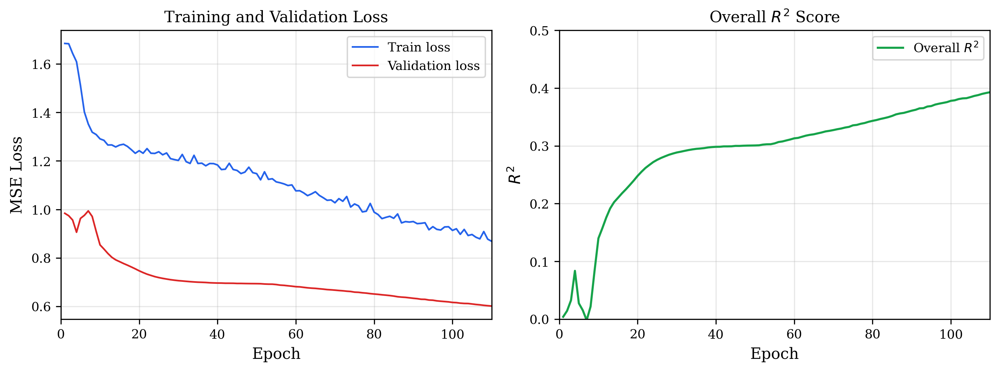
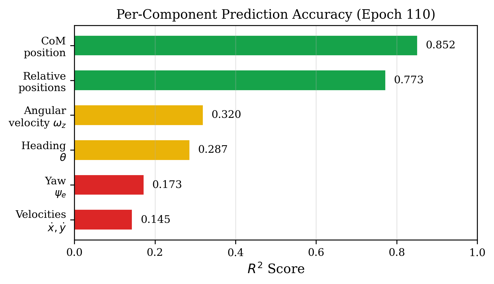
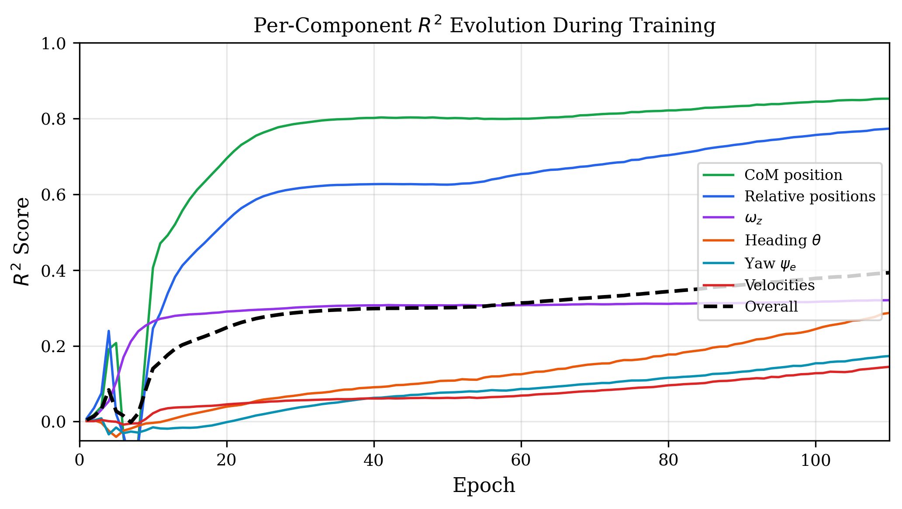
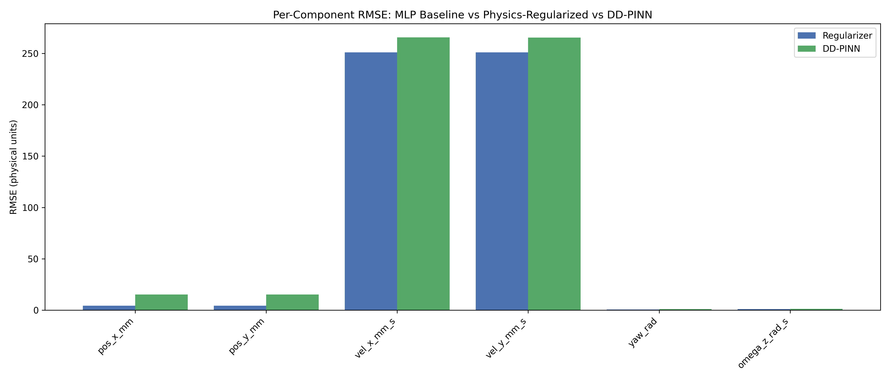
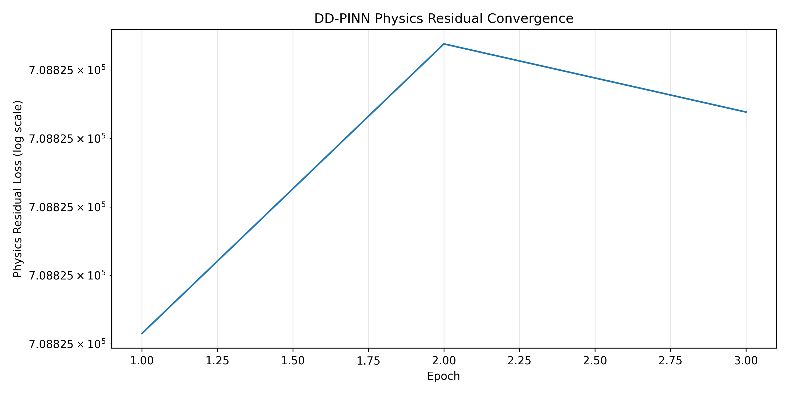
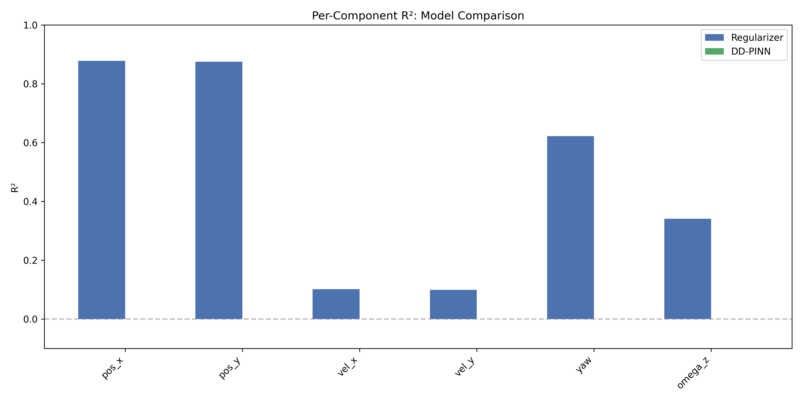
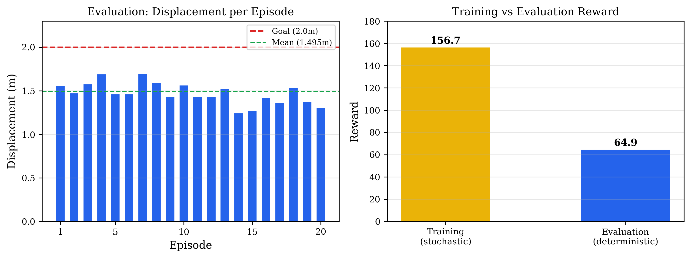

---

title: "Neural Surrogate Modeling for Snake Robot Locomotion: Faster Reinforcement Learning via Learned Cosserat Rod Dynamics"
author: |
  Qifan Wen
  Electrical and Computer Engineering
  The Ohio State University
  wen.679@buckeyemail.osu.edu

  Advisor: Prof. Abhishek Gupta (gupta.706@osu.edu)
date: ""
---

# Neural Surrogate Modeling for Snake Robot Locomotion: Faster Reinforcement Learning via Learned Cosserat Rod Dynamics


**Qifan Wen**
Electrical and Computer Engineering
The Ohio State University
wen.679@buckeyemail.osu.edu

*Advisor:* Prof. Abhishek Gupta -- gupta.706@osu.edu

## Abstract

*[Placeholder: Write abstract after all experimental results are available.]*

---

# Notation

| Symbol | Dimension | Meaning |
|---|---|---|
| $\mathbf{s}_t$ | $\mathbb{R}^{124}$ | Rod state vector at time step $t$ |
| $\mathbf{a}_t$ | $[-1,1]^5$ | Normalized CPG action vector |
| $T$ | $\mathbb{R}^{124} \times \mathbb{R}^5 \to \mathbb{R}^{124}$ | Ground-truth transition operator (PyElastica) |
| $f_\theta$ | $\mathbb{R}^{189} \to \mathbb{R}^{124}$ | Neural surrogate model with parameters $\theta$ |
| $\mathbf{z}_t$ | $\mathbb{R}^{189}$ | Surrogate input (state $\|$ action $\|$ phase encoding) |
| $\boldsymbol{\phi}_e$ | $\mathbb{R}^3$ | Per-element CPG phase triplet for element $e$ |
| $\mathbf{x}(s,t)$ | $\mathbb{R}^3$ | Rod centerline position at arc length $s$ |
| $\mathbf{d}(s,t)$ | $\mathbb{R}^3$ | Material director frame (orientation) |
| $\mathbf{F}$ | $\mathbb{R}^3$ | Internal force (shear and tension) |
| $\mathbf{M}$ | $\mathbb{R}^3$ | Internal moment (bending and torsion) |
| $\kappa_e^{\text{target}}$ | $\mathbb{R}$ | Target curvature at element $e$ |
| $\mu_\Delta, \sigma_\Delta$ | $\mathbb{R}^{124}$ | Training-set mean and std of state deltas |
| $N$ | 21 | Number of discretization nodes |
| $N_e$ | 20 | Number of discretization elements |


---

# 1 Introduction

Reinforcement learning for soft and continuum robots is bottlenecked by the cost of first-principles simulation.
A snake robot modeled as a Cosserat rod requires resolving elastic body dynamics, anisotropic ground friction, and internally generated muscle moments at every simulation substep --- PyElastica (Naughton et al., 2021) uses 500 Position Verlet substeps per control step, costing ${\sim}46$ ms per environment step.
This report presents a neural surrogate $f_\theta \approx T$ that replaces the transition operator with a single GPU forward pass (${\sim}0.001$ ms), targeting a four-to-five order-of-magnitude speedup for RL training.

The pipeline has three stages: (1) parallel data collection from 16 independent PyElastica workers (Section 4), (2) training a feedforward MLP surrogate on state-delta prediction with per-element CPG phase encoding (Section 5), and (3) PPO training in the surrogate environment with a direct Elastica baseline for comparison (Section 7).
Two physics backends are investigated --- PyElastica (explicit symplectic) and DisMech (implicit backward Euler) --- providing complementary perspectives on surrogate fidelity (Section 3).


---

# 2 Related Work


## 2.1 Neural Surrogates for ODE/PDE

Table 1 summarizes neural surrogate methods for elastic and soft robot dynamics that are directly relevant to the Cosserat rod setting considered here.

| **Reference** | **Method** | **Architecture** | **Speedup** | **Accuracy** | **Key contribution** |
|---|---|---|---|---|---|
| DD-PINN (Stolzle et al., 2025) | Domain-decoupled PINN | Feedforward NN | $44{,}000\times$ | 3 mm EE error (2.3%) | Time domain decoupled from network; closed-form gradients; MPC at 70 Hz on GPU |
| KNODE-Cosserat (Hsieh et al., 2024) | Hybrid physics + Neural ODE | Neural ODE residual | --- | 58.7% vs. physics-only | Coarse Cosserat backbone + learned correction; trained on PyElastica data |
| SoRoLEX (Berdica et al., 2024) | Learned simulator for RL | LSTM | $\sim\!10\times$ | Task-space obs. | Full pipeline: sim data -> surrogate -> PPO; JAX GPU parallelization |
| PINN Soft Robot (Author et al., 2025) | Physics-informed NN | PINN | $467\times$ | --- | MPC at 47 Hz; as little as 1 training dataset; articulated soft robot |
| **This work** | Data-driven MLP surrogate | MLP (3x512) | ${\sim}46{,}000\times$ (proj.) | *[Placeholder: ---]* | Per-element CPG phase encoding; two-phase training (single-step + rollout); full 124-dim state |

*Table 1: Neural surrogates for soft robot / Cosserat rod dynamics.*


The most closely related prior work is SoRoLEX, which shares an identical pipeline structure (collect trajectories from a high-fidelity simulator, train a neural dynamics model, run large-scale RL in the learned environment).
The present work differs in architecture (MLP vs. LSTM), prediction target (full 124-dimensional Cosserat rod state vs. task-space observation), and the explicit use of a multi-step rollout loss to limit autoregressive error accumulation.


## 2.2 RL Control for Snake and Soft Robots

Table 2 consolidates RL approaches for snake and soft robot control, spanning kinematic, rigid-body, and continuum-mechanics platforms.

| **Reference** | **Robot** | **Actions** | **Algo.** | **Simulator** | **Key contribution** |
|---|---|---|---|---|---|
| Shi et al. (2020) | 3-link kinem. | Joint vel. (disc.) | DQN | Analytical | SE(2) fiber bundle reduces state 5D->3D |
| Liu et al. (2021) | 4-link soft | CPG + option (6) | PPO | Custom | Multi-agent game for contact-aware nav. |
| Liu et al. (2022) | 9-link wheeled | Gait offset (1) | PPO | MuJoCo | RL modulates undulation for path following |
| Liu et al. (2023) | 4-link soft | CPG tonic (4) | PPO | MuJoCo | 12-level curriculum + domain randomization |
| Zheng et al. (2022) | 7-link rigid | CPG (5) | PPO | MuJoCo | Two-phase curriculum; series elastic act. |
| Jiang et al. (2024) | 11-joint COBRA | Dual CPG (7) | DDPG | MuJoCo | A*->RL->CPG->PID hierarchy |
| Schaffer et al. (2024) | Biohybrid worm | Muscle act. (42) | PPO | PyElastica | Adaptive muscle force ceilings |
| Choi & Tong (2025) | Soft manip. | $\Delta\kappa$ (5) | SAC | DisMech | Implicit Euler for contact-rich tasks |
| Bing et al. (2019) | Soft snake | CPG (5) | PPO | PyElastica | CPG reduces exploration vs. per-joint |
| Hong et al. (2026) | Soft robot | Joint torques | PPO | FEM | FEM essential for sim-to-real fidelity |
| Janner et al. (2019) | Rigid artic. | Joint torques | SAC+M | MuJoCo | Model-based short-horizon planning |
| Sanchez-Gonzalez et al. (2020) | Particles | Forces | --- | Custom | Graph network learns mesh-based physics |
| **This work** | Soft snake | CPG (5) | PPO | Elast./DM | Surrogate for 4--5 OOM speedup |

*Table 2: RL methods for snake and soft robot control.*


Several common themes emerge from these studies.
CPG-based action spaces dominate snake robot RL, reducing the exploration burden relative to per-joint torque control (Bing et al., 2019; Liu et al., 2021; Liu et al., 2023; Zheng et al., 2022; Jiang et al., 2024).
Curriculum learning and domain randomization are standard techniques for bridging the sim-to-real gap (Liu et al., 2023; Zheng et al., 2022).
All approaches share the same simulation cost bottleneck that motivates this work: MuJoCo-based environments require ${\sim}1$ ms per step, while Cosserat rod simulators such as PyElastica and DisMech cost $12$--$46$ ms per step.
The neural surrogate strategy developed here can be viewed as a model-based RL method where the learned model is the full transition operator rather than a latent dynamics model, enabling direct policy transfer evaluation between surrogate and real simulator and providing a drop-in replacement for any of these physics backends.


---

# 3 Physics Simulation Backends


## 3.1 Cosserat Rod Formulation

The Elastica backend solves a well-posed initial--boundary value problem for the Cosserat rod (Till et al., 2019; Naughton et al., 2021).
The system is fully specified by the tuple $\mathcal{S} = (\mathcal{L},\; \Omega,\; \text{BC},\; \text{IC},\; \boldsymbol{\theta})$:

| Component | Name | Specification |
|---|---|---|
| $\mathcal{L}$ | Governing equations | Cosserat rod PDEs: conservation of linear and angular momentum (Equations 1a, 1b) with linear elastic constitutive law (Equation 2) |
| $\Omega$ | Domain | $s \in [0, L]$, $L = 0.5$ m (arc length) $\times$ $t \in [0, T]$ (time) |
| BC | Boundary conditions | Free--free: $\mathbf{F} = \mathbf{M} = \mathbf{0}$ at $s = 0$ and $s = L$ |
| IC | Initial conditions | Straight rod at rest: $\mathbf{x}(s,0) = \mathbf{x}_0 + s\hat{\mathbf{e}}_x$, $\mathbf{v} = \boldsymbol{\kappa} = \boldsymbol{\omega} = \mathbf{0}$ |
| $\boldsymbol{\theta}$ | Parameters | $E{=}10^5$ Pa, $\nu{=}0.5$, $\rho{=}1200$ kg/m$^3$, $R{=}0.02$ m, $c_t{=}0.01$, $c_n{=}0.05$, $\gamma{=}0.002$ |
| Control | CPG forcing | $\mathbf{a} = (A, f, k, \phi_0, b) \in \mathbb{R}^5$ enters as time-varying rest curvature $\boldsymbol{\kappa}_0(s,t)$ |

*Table 3: Well-posedness tuple for the Elastica Cosserat rod system.*


**PDE (continuous).**

$$\begin{aligned}
  \rho A \,\frac{\partial \mathbf{v}}{\partial t}
    &= \frac{\partial \mathbf{F}}{\partial s} + \mathbf{f}_{\text{ext}}
    \qquad \text{(linear momentum)} \\[4pt]
  \rho \mathbf{I} \,\frac{\partial \boldsymbol{\omega}}{\partial t}
    &= \frac{\partial \mathbf{M}}{\partial s}
      + \mathbf{m}_{\text{ext}}
      + \frac{\partial \mathbf{x}}{\partial s} \times \mathbf{F}
    \qquad \text{(angular momentum)}
\end{aligned}$$

Constitutive closure:

$$\mathbf{F} = \mathbf{S}\,(\boldsymbol{\varepsilon} - \boldsymbol{\varepsilon}_0), \quad
  \mathbf{M} = \mathbf{B}\,(\boldsymbol{\kappa} - \boldsymbol{\kappa}_0), \quad
  \mathbf{S} = \operatorname{diag}(GA, GA, EA), \quad
  \mathbf{B} = \operatorname{diag}(EI, EI, GJ)$$


**ODE (semi-discrete).**
Spatial discretization on a staggered grid ($N{=}21$ nodes, $N_e{=}20$ elements) replaces the PDE with 124 coupled first-order ODEs:

$$\dot{\mathbf{s}} = \mathbf{g}(\mathbf{s},\, \mathbf{a},\, t), \qquad
  \mathbf{s} \in \mathbb{R}^{124},\;\; \mathbf{a} \in \mathbb{R}^{5}$$


**Equation count per RL step.**
Each of the 124 state variables is advanced by one first-order ODE, giving 124 coupled equations.
The Position Verlet integrator evaluates the right-hand side $\mathbf{g}(\mathbf{s}, \mathbf{a}, t)$ once per substep.
With $n_{\text{sub}} = 500$ substeps per RL action, a single RL step requires $500 \times 124 = 62{,}000$ scalar ODE evaluations, plus 500 curvature updates across 19 Voronoi nodes ($9{,}500$ trigonometric evaluations) and 500 friction force computations across 21 nodes ($10{,}500$ vector projections).
The total per-step computational budget is approximately $82{,}000$ scalar operations, or ${\sim}377{,}000$ FLOPs including the matrix--vector products and cross products within each evaluation.


**Integrator (fully discrete).**
Position Verlet ($\Delta t = 0.001$ s, $n_{\text{sub}} = 500$ substeps per RL step of $\Delta t_{\text{ctrl}} = 0.5$ s) advances the ODE to produce the transition operator:

$$\mathbf{s}_{t+1} = T(\mathbf{s}_t,\, \mathbf{a}_t)
    = \underbrace{V_{\Delta t}(\,\cdot\,;\, \boldsymbol{\kappa}^{\text{rest},499}) \circ \cdots \circ V_{\Delta t}(\,\cdot\,;\, \boldsymbol{\kappa}^{\text{rest},0})}_{500 \text{ substeps, each with distinct rest curvature}}(\mathbf{s}_t)$$

Algorithm 1 expands this operator into its full computational form.
The 2D restriction ($z \equiv 0$) is exact for planar locomotion.

| Slice | Variable | Count | Meaning |
|---|---|---|---|
| `[0:21]` | $x_i$ | 21 | Node $x$-positions (m) |
| `[21:42]` | $y_i$ | 21 | Node $y$-positions (m) |
| `[42:63]` | $\dot{x}_i$ | 21 | Node $x$-velocities (m s$^{-1}$) |
| `[63:84]` | $\dot{y}_i$ | 21 | Node $y$-velocities (m s$^{-1}$) |
| `[84:104]` | $\psi_e$ | 20 | Element yaw angle (rad) |
| `[104:124]` | $\omega_{z,e}$ | 20 | Element angular velocity (rad s$^{-1}$) |

*Table 4: State vector $\mathbf{s}_t \in \mathbb{R}^{124}$ layout (Elastica).*


## 3.2 CPG Control

The Central Pattern Generator (CPG) drives locomotion by imposing a time-varying rest curvature on the rod.
The RL agent selects five CPG wave parameters per control step:

| Symbol | Name | Range | Units |
|---|---|---|---|
| $A$ | Amplitude | $[0, 5]$ | rad m$^{-1}$ |
| $f$ | Frequency | $[0.5, 3.0]$ | Hz |
| $k$ | Wave number | $[0.5, 3.5]$ | wavelengths/body |
| $\phi_0$ | Phase offset | $[0, 2\pi]$ | rad |
| $b$ | Turn bias | $[-2, 2]$ | rad m$^{-1}$ |

*Table 5: Action vector $\mathbf{a}_t \in \mathbb{R}^{5}$: CPG wave parameters.*


These parameters define the serpenoid rest curvature at each Voronoi node:

$$\kappa_v^{\text{rest}}(t) = A \sin(2\pi k \cdot s_v + 2\pi f \cdot t + \phi_0) + b, \qquad v = 1, \ldots, 19.$$

The action parameters are held fixed for one RL step ($\Delta t_{\text{ctrl}} = 0.5$ s), but $\kappa_v^{\text{rest}}$ is recomputed at every substep because the temporal phase $2\pi f \cdot t$ advances by $\Delta\phi = 2\pi f \Delta t$ per substep.
Over one RL step, the phase sweeps through $2\pi f \cdot \Delta t_{\text{ctrl}}$ radians --- up to $3\pi$ radians at $f = 3$ Hz.
The neural surrogate (Section 5) replaces the entire transition operator $T$ with a single forward pass, approximating the integrated effect of these 500 substeps.

DisMech applies curvature through the natural strain of discrete bend springs rather than the rest curvature array, and sets it once per RL step rather than per substep.
The curvature is applied as:

$$\texttt{bend\_springs.nat\_strain}[j, 0] \;\gets\; \kappa_j^{\text{rest}},
  \quad j = 1, \ldots, 19.$$

Because the implicit solver takes a single $\Delta t = 0.05$ s step, the continuous curvature evolution that Elastica captures across 500 substeps is collapsed to a single snapshot at $t_{\text{step}}$ in DisMech.


## 3.3 PyElastica Backend

The Elastica transition operator implements a Position Verlet integrator that advances the 124-dimensional ODE system through 500 substeps per RL action.
Algorithm 1 expands this operator into its full computational form.
The 2D restriction ($z \equiv 0$) is exact for planar locomotion.


**Algorithm 1: Elastica Transition Operator $T(\mathbf{s}_t, \mathbf{a}_t, t_{\text{step}}) \to \mathbf{s}_{t+1}$**

```plaintext
Parameters:
  dt = 0.001 s (substep), n_sub = 500 (substeps/step), dt_ctrl = 0.5 s (RL step)
  S (shear-stretch stiffness), B (bend-twist stiffness)
  c_t, c_n (RFT friction), gamma (damping), m (nodal masses), J (elem inertias)

State:
  q in R^62 (positions: x_i, y_i in R^(21x2), psi_e in R^20)
  dq in R^62 (velocities: dx_i, dy_i in R^(21x2), omega_z,e in R^20)
  s = (q, dq) in R^124

CPG: A, f, k, phi_0, b from a_t; s_v in [0,1] (arc-length); t^n (substep time)

Grid ops:
  D in R^(20x21) (node->elem), D^T in R^(21x20) (elem->node)
  A_v in R^(19x20) (elem->Voronoi), D_v in R^(20x19) (Voronoi->elem)

Algorithm:
  1: s <- s_t
  2: for n = 0, 1, ..., n_sub - 1 do
       // Control input: PDE forcing term kappa_0(s,t)
  3:   t^n <- t_step + n * dt
  4:   for v = 1, ..., 19 do
  5:     kappa_v^rest <- A sin(2*pi*k * s_v + 2*pi*f * t^n + phi_0) + b
       end for
       // Integrator: Verlet half-step
  6:   q^(1/2) <- q + (1/2)*dt * dq
       // ODE right-hand side: discretized PDE
       // --- geometry
  7:   Delta_x_e <- D * x^(1/2)
  8:   l_e <- ||Delta_x_e||
  9:   t_e <- Delta_x_e / l_e
 10:   eps_e <- l_e / l_e^rest
       // --- shear-stretch: internal forces on nodes (translational)
 11:   sigma_e <- Q_e^T (Delta_x_e / l_e^rest)
 12:   n_e^L <- S * (sigma_e - sigma_e^rest)
 13:   F^int <- D^T [Q_e * n_e^L / eps_e]
       // --- bend-twist: internal torques on elements (rotational)
 14:   kappa_v <- curvature from directors at Voronoi
 15:   tau_v^L <- B * (kappa_v - kappa^rest)
 16:   m^int <- D_v[tau_v^L / eps_hat_v^3]
              + A_v[(kappa_v x tau_v^L) * l_hat_v / eps_hat_v^3]
              + (Q_e * t_e) x n_e^L * l_e^rest + ...
       // --- external forces on nodes (R^(21x2))
 17:   F^ext <- -c_t * v_t - c_n * v_n - gamma*dx + m*g^T
       // --- accelerations
 18:   ddx <- (F^int + F^ext) / (m * 1^T)
 19:   domega_z <- m^int / (eps_e * J)
       // Integrator: Verlet velocity update + full-step
 20:   dq <- dq + dt * ddq
 21:   q <- q^(1/2) + (1/2)*dt * dq
     end for
 22: return s = (q, dq)


Cost: ~754 scalar ops/substep x 500 = ~377,000 ops/step (~46 ms on CPU).

Key: kappa^rest changes every substep --- the CPG phase advances by
     dphi = 2*pi*f*dt per substep, accumulating 2*pi*f*dt_ctrl radians
     over one RL step. The surrogate must learn the integrated effect
     of this traveling wave, not a single static curvature.
```


### 3.3.1 Method of Lines and Explicit Integration

The Cosserat rod is governed by PDEs in arc length $s$ and time $t$, yet Algorithm 1 contains no iterative solver --- every line is a direct assignment.
This is possible because of a **two-stage reduction** that converts the continuous PDE into a deterministic arithmetic map.


**Stage 1 --- spatial discretization (method of lines).**
All spatial derivatives $\partial/\partial s$ are replaced by sparse matrix--vector products on the staggered grid (Section 3.3.2):
- Force gradient: $\partial \mathbf{F}/\partial s \;\to\; \mathbf{D}^T \mathbf{F}_e$ (bidiagonal, $O(N)$ ops).
- Strain from geometry: $\boldsymbol{\varepsilon}_e = \mathbf{Q}_e^T (\mathbf{x}_{e+1} - \mathbf{x}_e)/\ell_e^{\text{rest}}$ (subtract, rotate).
- Constitutive law: $\mathbf{F}_e = \mathbf{S}(\boldsymbol{\varepsilon}_e - \boldsymbol{\varepsilon}_e^{\text{rest}})$ (pointwise multiply).

After replacement, no spatial derivative remains.
The PDE in $(s,t)$ becomes the ODE system $\dot{\mathbf{s}} = \mathbf{g}(\mathbf{s}, \mathbf{a}, t)$ (Equation 3), where $\mathbf{g}$ is a **closed-form function** --- a chain of geometry -> strains -> constitutive law -> forces -> accelerations, each computed by explicit algebra.


**Stage 2 --- explicit time integration.**
An explicit integrator advances the ODE by evaluating $\mathbf{g}$ at the *current* state and writing the result directly:

$$\mathbf{s}^{n+1} = \Phi(\mathbf{s}^n, \Delta t)$$

The unknown $\mathbf{s}^{n+1}$ appears *only on the left-hand side* --- there is no equation to solve.
Position Verlet evaluates $\mathbf{g}$ at a half-step configuration and updates positions and velocities in three sequential assignments.
The result: each substep $V_{\Delta t}$ is a deterministic map $\mathbb{R}^{124} \to \mathbb{R}^{124}$ composed entirely of arithmetic.


**Explicit vs. implicit integration.**
The defining distinction is whether the unknown state appears on the right-hand side.

| **Method** | **Update rule** | **Type** |
|---|---|---|
| Forward Euler | $\mathbf{s}^{n+1} = \mathbf{s}^n + \Delta t\,\mathbf{g}(\mathbf{s}^n)$ | Explicit |
| Backward Euler | $\mathbf{s}^{n+1} = \mathbf{s}^n + \Delta t\,\mathbf{g}(\mathbf{s}^{n+1})$ | Implicit |
| Position Verlet (Elastica) | Algorithm 1 | Explicit |

*Table 6: Explicit vs. implicit update rules.*


If $\mathbf{s}^{n+1}$ appears on the right-hand side, a Newton solve is required at every timestep (see Section 3.4.3 for this approach in DisMech).


**CFL stability constraint.**
Explicit methods are **conditionally stable**: the timestep must satisfy a Courant--Friedrichs--Lewy (CFL) bound set by the fastest wave mode (bending in the stiffest element):

$$\Delta t < C\,\sqrt{\frac{\rho A\,\Delta s^4}{EI}}$$

With the project's rod parameters this gives $\Delta t_{\max} \approx 1.7 \times 10^{-3}$ s.
PyElastica uses $\Delta t = 10^{-3}$ s, safely below the limit, but this forces $n_{\text{sub}} = 500$ substeps per RL action ($\Delta t_{\text{ctrl}} = 0.5$ s).
Implicit methods are unconditionally stable --- DisMech uses $\Delta t = 0.05$ s ($50\times$ larger) at the cost of a Newton solve per step.
Table 15 provides the full property comparison between the two backends.


**Surrogate implications.**
The neural surrogate replaces the 500-step composition $T(\mathbf{s}_t, \mathbf{a}_t) = V_{\Delta t}^{500}(\mathbf{s}_t; \mathbf{a}_t)$ (Equation 5) --- a **deterministic sequential map**, not a PDE solver.
Each substep $V_{\Delta t}$ is a chain of explicit arithmetic (geometry, constitutive law, force balance, Verlet update); the computational cost arises from composing 500 such maps sequentially, with each depending on the output of the previous one.
The surrogate collapses this sequential composition into a single forward pass.
Because $T$ is a smooth, deterministic function with no iterative convergence involved, a feedforward network can approximate the composed map directly --- in contrast to DisMech (Section 3.4), where the surrogate must additionally learn to bypass the Newton solver's convergence behavior.


### 3.3.2 Staggered Grid Discretization

The continuous Cosserat rod is discretized on a **staggered grid** with three interleaved layers (Figure 1).
This structure explains the decomposition of the 124-dimensional state vector in Table 4.


*Figure 1: The three-layer staggered grid. Nodes (blue circles) sit at the rod vertices; elements (red squares) span between adjacent nodes; Voronoi nodes (green diamonds) sit between adjacent elements. Arrows show the sparse matrix operators that transfer information between layers.*


| Layer | Index | DOF | Variables | Total |
|---|---|---|---|---|
| Nodes | $i = 1, \ldots, 21$ | Translational | $x_i, y_i, \dot{x}_i, \dot{y}_i$ | 84 |
| Elements | $e = 1, \ldots, 20$ | Rotational | $\psi_e, \omega_{z,e}$ | 40 |
| Voronoi | $v = 1, \ldots, 19$ | Derived | $\kappa_v, \kappa_v^{\text{rest}}$ | 0 |
| **Total independent state variables** | | | | **124** |

*Table 7: The three staggered-grid layers and their stored degrees of freedom.*


Nodes are the rod vertices; elements are the segments connecting adjacent nodes; Voronoi nodes sit between adjacent elements and are the natural location for computing curvature $\kappa_v$ --- the quantity that couples the CPG control input to the rod's elastic response.
Voronoi nodes carry no independent state; their quantities are derived from element values.

Four sparse matrix operators move information between layers:

| Operator | Direction | Size | Structure | Physical role |
|---|---|---|---|---|
| $\mathbf{D}$ | Node -> Element | $20 \times 21$ | Bidiagonal | Position differences -> strain |
| $\mathbf{D}^T$ | Element -> Node | $21 \times 20$ | Bidiagonal | Internal stress -> nodal forces |
| $\mathbf{A}_v$ | Element -> Voronoi | $19 \times 20$ | Tridiagonal | Element averages -> curvature |
| $\mathbf{D}_v$ | Voronoi -> Element | $20 \times 19$ | Bidiagonal | Bending couple gradient -> torques |

*Table 8: Sparse operators connecting the three staggered-grid layers. Each has $O(N)$ nonzero entries.*


### 3.3.3 External Force Handling

At each substep, the Elastica backend computes and applies the following external forces and torques to the rod.
Table 9 summarizes all force types, their mathematical form, and where they act in the staggered grid.

| Force type | Acts on | Formula | Parameters | Notes |
|---|---|---|---|---|
| Gravity | Nodes ($i$) | $\mathbf{f}_i^{\text{grav}} = m_i \mathbf{g}$ | $\mathbf{g} = (0, 0, -9.81)$ m s$^{-2}$ | Zero in 2D planar mode |
| RFT friction | Nodes ($i$) | $\mathbf{f}_i^{\text{rft}} = -c_t \mathbf{v}_{t,i} - c_n \mathbf{v}_{n,i}$ | $c_t{=}0.01$, $c_n{=}0.05$ | Anisotropic; enables serpentine propulsion |
| Numerical damping | Nodes ($i$) | $\mathbf{f}_i^{\text{damp}} = -\gamma \dot{\mathbf{x}}_i$ | $\gamma = 0.002$ | Suppresses high-freq. numerical ringing |
| Bending actuation | Voronoi ($v$) | $\boldsymbol{\kappa}_v^{\text{rest}}(t)$ via constitutive law | CPG parameters $\mathbf{a}_t$ | Internal torque from elastic restoring force |

*Table 9: External forces and torques in PyElastica.*


The total external force at each node is $\mathbf{F}_i^{\text{ext}} = \mathbf{f}_i^{\text{grav}} + \mathbf{f}_i^{\text{rft}} + \mathbf{f}_i^{\text{damp}}$.
RFT friction decomposes each node's velocity into tangential and normal components relative to the local rod tangent.
The 5:1 anisotropy ratio ($c_n/c_t = 5$) produces net forward thrust during lateral undulation.
PyElastica also supports Coulomb and Stribeck friction models, but RFT is used exclusively in this project for its computational simplicity and adequate fidelity for planar locomotion.


## 3.4 DisMech Backend

The second physics backend uses Discrete Elastic Rods (DER) via the DisMech simulator (Bergou et al., 2008; Bergou et al., 2010).
DisMech replaces PyElastica's explicit symplectic integration with implicit backward Euler, which is unconditionally stable and permits a single step of $\Delta t = 0.05$ s per RL action --- eliminating the 500-substep inner loop.
Algorithm 2 expands the resulting transition operator.


### 3.4.1 System Formulation

The Cosserat rod PDEs (Equations 1a, 1b) and constitutive law (Equation 2) apply identically.
The well-posedness tuple $\mathcal{S}$ matches Table 3 except for the solver parameters:

| Parameter | PyElastica | DisMech |
|---|---|---|
| Integration scheme | Explicit symplectic (Verlet) | Implicit (backward Euler) |
| Timestep | $\Delta t_{\text{sub}} = 0.001$ s | $\Delta t = 0.05$ s |
| Steps per RL action | 500 substeps | 1 step |
| Stability | Conditional (CFL) | Unconditional |
| Damping | $\gamma = 0.002$ | Numerical dissipation (implicit) |
| Solver tolerances | --- | $\epsilon_f {=} 10^{-4}$, $\epsilon_d {=} 10^{-2}$, max 25 iter |

*Table 10: Solver-parameter differences between backends (all other tuple entries are shared).*


**Primary unknowns.**
DER uses vertex positions and a material frame (Bishop frame).
At each internal vertex $i$ the discrete curvature binormal is:

$$\boldsymbol{\kappa}_i
    = \frac{2\,\mathbf{e}_{i-1} \times \mathbf{e}_i}
           {|\mathbf{e}_{i-1}|\,|\mathbf{e}_i| + \mathbf{e}_{i-1} \cdot \mathbf{e}_i},
  \qquad
  \mathbf{e}_i = \mathbf{x}_{i+1} - \mathbf{x}_i.$$


**Discrete bending energy.**

$$E_{\text{bend},i}
    = \frac{1}{2\bar{\ell}_i}
      (\boldsymbol{\kappa}_i - \boldsymbol{\kappa}_i^{\text{rest}})^\top
      \mathbf{B}\,
      (\boldsymbol{\kappa}_i - \boldsymbol{\kappa}_i^{\text{rest}}),$$

where $\bar{\ell}_i$ is the Voronoi length (mean of adjacent edge lengths) and $\boldsymbol{\kappa}_i^{\text{rest}}$ is the rest curvature (control input).


**State vector.**
The 124-dimensional layout matches Table 4 exactly.
Table 11 details how each component is extracted from DisMech's 3D state.

| Component | Source | Extraction | Count |
|---|---|---|---|
| $x_i, y_i$ | $\mathbf{q} \in \mathbb{R}^{63}$ | $(x, y)$ of each node; $z \equiv 0$ (2D mode) | 42 |
| $\dot{x}_i, \dot{y}_i$ | $\mathbf{u} \in \mathbb{R}^{63}$ | $(x, y)$ of each node velocity | 42 |
| $\psi_e$ | Derived | $\text{atan2}(\Delta y_e,\, \Delta x_e)$ from segment tangents | 20 |
| $\omega_{z,e}$ | Derived | $(\Delta x_e \Delta\dot{y}_e - \Delta y_e \Delta\dot{x}_e) / |\Delta\mathbf{x}_e|^2$ | 20 |
| **Total** | | | **124** |

*Table 11: State extraction: DisMech 3D -> shared 124-dim representation.*


### 3.4.2 DisMech Algorithm: Discrete Elastic Rods

The DisMech transition operator solves a single implicit backward Euler step per RL action via Newton iteration.
Algorithm 2 expands the full computational procedure.


**Algorithm 2: DisMech Transition Operator $T_{\text{DER}}(\mathbf{s}_t, \mathbf{a}_t, t_{\text{step}}) \to \mathbf{s}_{t+1}$**

```plaintext
Parameters:
  dt = 0.05 s (timestep), eps_f = 1e-4 (force tol.), eps_d = 1e-2 (disp. tol.)
  K = 25 (max Newton iter), S (shear-stretch stiffness), B (bending stiffness)
  mu (friction coeff.), m_i (lumped mass at node i), g (gravity)

State:
  q in R^63 (positions: x_i, y_i, z_i; z_i = 0 in 2D mode)
  v in R^63 (velocities: dx_i, dy_i, dz_i)
  s = (q, v) in R^126

CPG: A, f, k, phi_0, b from a_t; s_j in [0,1] (arc-length); t_step (RL time)

Algorithm:
  1: s <- s_t
     // Control input: set curvature once per RL step
  2: omega <- 2*pi*f
  3: for j = 1, ..., 19 do
  4:   kappa_j^rest <- A sin(2*pi*k * s_j + omega * t_step + phi_0) + b
     end for

     // Apply to bend springs (DER control API)
  5: for j = 1, ..., 19 do
  6:   nat_strain[j, 0] <- kappa_j^rest; nat_strain[j, 1] <- 0  (Planar)
     end for

     // Initial guess: explicit Euler predictor
  7: q^(0) <- q + dt * v
     // Newton iterations: solve g(q_{n+1}) = 0
  8: for k = 0, 1, ..., K-1 do
       // --- assemble residual
  9:   F <- F_elastic(q^(k)) + F_ext(q^(k))
 10:   g <- M(q^(k) - 2q + q_prev) - dt^2 * F
       // --- assemble Jacobian and solve
 11:   J <- dg/dq |_{q^(k)}                    (Sparse banded)
 12:   dq <- J^{-1} g                           (Direct factorization)
 13:   q^(k+1) <- q^(k) - dq
       // --- convergence check
 14:   if ||g|| < eps_f or ||dq|| < eps_d then break
     end for

     // Update velocity from converged position
 15: v' <- (q^(K) - q) / dt
     // Pack 3D state -> 2D 124-dim
 16: (x_i, y_i) <- q'_{3i:3i+2}; (dx_i, dy_i) <- v'_{3i:3i+2}  (Drop z)
 17: e_e <- D * x'; psi_e <- atan2(e_{e,y}, e_{e,x})
 18: omega_{z,e} <- (Dx_e * Ddy_e - Dy_e * Ddx_e) / |Dx_e|^2
 19: return s_{t+1} = (x, y, dx, dy, psi, omega_z) in R^124


Cost: 1 Newton solve with ~3-5 iterations, ~12 ms on CPU (sparse direct factorization).
      No substep loop.

Key: kappa^rest is set once per RL step --- the CPG wave is a single snapshot
     at t_step, unlike Elastica where the phase advances by dphi = 2*pi*f*dt_sub
     across 500 substeps. The surrogate must learn from this coarser temporal
     resolution.
```


### 3.4.3 Discrete Elastic Rod Discretization

DER follows a vertex--edge--hinge structure analogous to the staggered grid (Figure 1).
Table 12 maps the DER terminology to the Elastica grid layers from Table 7.

| DER term | Elastica term | Index range | DOF type | Stores | Total |
|---|---|---|---|---|---|
| Vertices | Nodes | $i = 1, \ldots, 21$ | Translational | $\mathbf{x}_i, \dot{\mathbf{x}}_i$ | 84 |
| Edges | Elements | $e = 1, \ldots, 20$ | Rotational | $\psi_e, \omega_{z,e}$ | 40 |
| Hinges | Voronoi | $v = 1, \ldots, 19$ | Derived | $\boldsymbol{\kappa}_v, \boldsymbol{\kappa}_v^{\text{rest}}$ | 0 |
| **Total independent state variables** | | | | | **124** |

*Table 12: DER discretization layers mapped to the staggered grid.*


The sparse operators $\mathbf{D}$, $\mathbf{D}^T$, $\mathbf{A}_v$, $\mathbf{D}_v$ (Table 8) apply identically; DisMech implements them via direct array indexing rather than sparse matrix--vector products.


### 3.4.4 Implicit Time Integration


**Backward Euler formulation.**
Given positions $\mathbf{q}_n$ and velocities $\mathbf{v}_n$:

$$\begin{aligned}
  \mathbf{v}_{n+1} &= \mathbf{v}_n + \Delta t\,\mathbf{M}^{-1}\mathbf{F}(\mathbf{q}_{n+1},\, \mathbf{v}_{n+1}), \\
  \mathbf{q}_{n+1} &= \mathbf{q}_n + \Delta t\,\mathbf{v}_{n+1},
\end{aligned}$$

where $\mathbf{M}$ is the mass matrix and $\mathbf{F}$ includes all internal elastic forces and external forces.
$\mathbf{F}$ is evaluated at the unknown future state $(\mathbf{q}_{n+1}, \mathbf{v}_{n+1})$, making the system implicit.


**Nonlinear residual.**
Substituting the position equation into the velocity equation:

$$\mathbf{g}(\mathbf{q}_{n+1})
    \coloneqq \mathbf{M}\bigl(\mathbf{q}_{n+1} - 2\mathbf{q}_n + \mathbf{q}_{n-1}\bigr)
    - \Delta t^2\,\mathbf{F}(\mathbf{q}_{n+1})
    = \mathbf{0}.$$


**Newton solver.**
Each timestep solves the residual iteratively:

$$\mathbf{q}^{(k+1)} = \mathbf{q}^{(k)} - \mathbf{J}^{-1}(\mathbf{q}^{(k)})\,\mathbf{g}(\mathbf{q}^{(k)}),
  \qquad
  \mathbf{J} = \frac{\partial\mathbf{g}}{\partial\mathbf{q}}.$$

| Criterion | Condition | Default |
|---|---|---|
| Force residual | $\|\mathbf{g}(\mathbf{q}^{(k)})\| < \epsilon_f$ | $\epsilon_f = 10^{-4}$ |
| Displacement | $\|\delta\mathbf{q}\| < \epsilon_d$ | $\epsilon_d = 10^{-2}$ |
| Iteration limit | $k < K$ | $K = 25$ |

*Table 13: Newton solver convergence criteria.*


Convergence is declared when either the force or displacement criterion is met.
The Jacobian $\mathbf{J}$ (tangent stiffness + mass) is sparse; the linear system is solved via direct factorization.
The full computational procedure is given in Algorithm 2.
The neural surrogate (Section 5) replaces $T_{\text{DER}}$ with a single forward pass, using the same architecture and training procedure as the Elastica surrogate.
The only adaptation is the state extraction layer (Table 11) that packs DisMech's 3D vertex state into the shared 124-dimensional representation.


## 3.5 Backend Comparison

Table 15 provides a comprehensive comparison of the two physics backends across solver properties, supported physics, and project metadata.

| **Property** | **PyElastica** | **DisMech** |
|---|---|---|
| ***Solver*** | | |
| Physics model | Cosserat rod theory | Discrete Elastic Rods (DER) |
| Integration scheme | Explicit symplectic (Verlet / PEFRL) | Implicit backward Euler (Newton) |
| Timestep per call | $\Delta t_{\text{sub}} = 0.001$ s | $\Delta t = 0.05$ s |
| Steps per RL action | 500 substeps | 1 step |
| Stability | Conditional (CFL) | Unconditional |
| Per-step cost | ${\sim}46$ ms (500 explicit evals) | ${\sim}12$ ms (1 Newton solve) |
| Energy behavior | Bounded drift (symplectic) | Numerical dissipation |
| Linear system solve | None (explicit) | Sparse direct factorization |
| ***Supported forces and torques*** | | |
| Shear--stretch | Yes | Yes |
| Bending moment | Yes | Yes |
| Torsion | Yes | Yes |
| Gravity | Yes | Yes |
| RFT (anisotropic drag) | Yes | --- |
| Coulomb / Stribeck friction | Yes | --- |
| Viscous damping | Yes ($\gamma{=}0.002$) | Yes (optional) |
| Self-contact | --- | Yes (FCL) |
| ***Control*** | | |
| Curvature mechanism | Elastic rest shape ($\kappa_0$) | Hard constraint (natural strain) |
| CPG resolution | 500 curvature updates/step | 1 curvature snapshot/step |
| ***Project metadata*** | | |
| Publication year | 2021 (Naughton et al., 2021) | 2008/2010 (Bergou et al., 2008; Bergou et al., 2010) |
| Implementation language | Python (Numba JIT) | C++ (Python bindings) |
| License | MIT | MIT |

*Table 15: Comprehensive comparison of PyElastica and DisMech.*


Table 16 compares the internal and external force and torque types supported by each backend.

| Force / Torque type | **PyElastica** | **DisMech** |
|---|---|---|
| ***Internal forces*** | | |
| Shear--stretch (axial + transverse) | Yes | Yes |
| Bending moment (curvature) | Yes | Yes |
| Torsion (twist) | Yes | Yes |
| ***External forces*** | | |
| Gravity | Yes | Yes |
| RFT (anisotropic velocity drag) | Yes | --- |
| Coulomb friction | Yes | --- |
| Stribeck friction | Yes | --- |
| Viscous damping (isotropic) | Yes | Yes |
| Self-contact (collision detection) | --- | Yes |
| ***Control torques*** | | |
| Rest curvature (elastic target) | Yes | --- |
| Natural strain (hard constraint) | --- | Yes |

*Table 16: Force and torque types: PyElastica vs. DisMech.*


The key difference in friction modeling is that DisMech's C++ backend does not support RFT at the native level; ground contact is modeled exclusively through viscous damping forces.
PyElastica supports three friction models (RFT, Coulomb, Stribeck) but lacks self-contact detection, which DisMech provides via FCL-based collision.

The fundamental trade-off is between **temporal fidelity** and **computational cost**.
PyElastica's 500 substeps capture the continuous evolution of the CPG curvature wave, but require $4\times$ more wall-clock time per RL step.
DisMech's single implicit step is faster and unconditionally stable, but collapses the intra-step dynamics to a single curvature snapshot.
For surrogate modeling, the Elastica backend presents a harder approximation target (the surrogate must learn the integrated effect of 500 distinct curvature configurations), while DisMech presents a simpler one-shot mapping.


---

# 4 Data Collection


## 4.1 Elastica Data Collection Pipeline

Training data for the surrogate model is generated by running 16 independent worker processes, each maintaining its own PyElastica Cosserat rod simulation instance.
Actions are sampled from the 5-dimensional CPG action space using a Sobol quasi-random sequence, which distributes points more uniformly across all dimensions than pseudo-random sampling.
To populate diverse regions of the state space, 30% of episodes begin with a state perturbation: random offsets are applied to node positions, and angular velocity noise is injected into the rod elements with $\sigma_\omega = 1.5$ rad/s (see Section 8.3 for the rationale behind this value).

Within each episode, 50% of actions are drawn uniformly at random and the remaining 50% follow the Sobol sequence.


**
Algorithm 3: Parallel data collection for surrogate training**

```plaintext
Require: Number of workers W = 16, Sobol sequence S, perturbation fraction p = 0.3
Ensure: Dataset D = {(s_t, a_t, s_{t+1})}
for each worker w = 1, ..., W in parallel do
  while not done do
    Initialize rod; with probability p, perturb state
    Sample action a from S (50%) or uniform (50%)
    Execute one RL step: s_{t+1} <- T(s_t, a_t)
    Store (s_t, a_t, s_{t+1}, t_start) to batch file
  end while
end for
```


The collection format stores one transition per row: the current state $\mathbf{s}_t$, the action $\mathbf{a}_t$, the next state $\mathbf{s}_{t+1}$, the episode start time $t_{\text{start}}$, and optionally the internal and external forces and torques acting on the rod.
At approximately 2055 bytes per transition including forces, the target dataset size of 10 GB yields roughly 5 million transition pairs.
A health monitor tracks the output rate of each worker and respawns any worker that stalls after initialization, ensuring sustained throughput across multi-hour collection runs.

| **Parameter** | **Value** |
|---|---|
| Number of parallel workers | 16 |
| Action sampling | 50% Sobol quasi-random, 50% uniform |
| State perturbation fraction | 30% of episodes |
| Angular velocity perturbation $\sigma_\omega$ | 1.5 rad/s |
| Transition size (with forces) | ${\sim}2055$ bytes |
| Target dataset size | ${\sim}10$ GB (${\sim}5$M transitions) |
| Per-worker throughput | ${\sim}22$ transitions/s |
| Aggregate throughput | ${\sim}350$ transitions/s |
| Fields per transition | $\mathbf{s}_t$, $\mathbf{a}_t$, $\mathbf{s}_{t+1}$, $t_{\text{start}}$, forces (optional) |

*Table 17: Data collection pipeline parameters.*


## 4.2 Dataset Quality

The final dataset contains 4,336,600 single-step transitions stored across 43,366 batch files.
An automated validation pipeline checks the dataset against quality thresholds before surrogate training; the results are summarized in Table 18.

| **Metric** | **Value** | **Threshold** | **Status** |
|---|---|---|---|
| NaN/Inf rate | 0.00% | $<0.1\%$ | Pass |
| Duplicate transitions | 3.84% (166,518) | $<1\%$ | Fail |
| Constant features | 0 | 0 | Pass |
| Outlier rate ($>5\sigma$) | 0.096% | $<0.5\%$ | Pass |
| Action 5D fill fraction | 74.5% | $>5\%$ | Pass |
| Per-dim action fill | 100% (all dims) | $>90\%$ | Pass |

*Table 18: Data quality validation results.*


Action coverage is excellent: Sobol quasi-random sampling achieves 100% per-dimension fill (20 bins) and 74.5% 5D joint fill across 3.2M bins, substantially better than pseudo-random sampling for the same budget.
All five action dimensions (amplitude, frequency, wave number, phase offset, direction bias) have uniform marginal distributions (mean ${\approx}\,0$, std ${\approx}\,0.577$, consistent with $\mathcal{U}(-1,1)$).

The 3.84% duplicate rate is attributed to the 1-step episode structure: workers that reset to identical initial conditions and receive the same Sobol action produce identical transitions.
Deduplication yields 4,170,082 unique transitions.
While the duplicate rate exceeds the automated threshold, these duplicates amount to implicit oversampling of common initial conditions and do not introduce label noise, so the dataset was used for training without deduplication.

Outlier analysis reveals that velocity ($\dot{x}$, $\dot{y}$) and angular velocity ($\omega_z$) components account for 97% of all $>5\sigma$ outliers.
These arise from contact-induced velocity spikes during friction interactions and are physically plausible, so they were retained in the training set.
The surrogate's difficulty predicting these components (Section 5.5) is consistent with their high variance and heavy-tailed distributions in the training data.


---

# 5 Neural Surrogate Model


## 5.1 State and Action Representation for Elastica

The full 124-dimensional rod state vector $\mathbf{s}_t \in \mathbb{R}^{124}$, defined in Table 4, serves as the Markov state for both surrogate training and RL.
The 2D projection from the 3D Cosserat state is exact --- $z$-components are identically zero --- so no physical content is lost.

The action vector $\mathbf{a}_t \in [-1,1]^5$ is linearly mapped to the physical CPG parameter ranges defined in Table 5:

$$\mathbf{a}_{\text{phys}} = \frac{1}{2}\bigl[(\mathbf{a}_t + 1) \odot (\mathbf{a}_{\max} - \mathbf{a}_{\min}) + 2\,\mathbf{a}_{\min}\bigr]$$

- $\mathbf{a}_t \in [-1,1]^5$ --- normalized action from the RL policy
- $\mathbf{a}_{\max}$, $\mathbf{a}_{\min}$ --- upper and lower bounds of each CPG parameter
- $\odot$ --- element-wise multiplication

Denormalization to physical units occurs only inside the PyElastica environment; the surrogate receives $\mathbf{a}_t$ directly.


## 5.2 Per-Element CPG Phase Encoding

The target curvature at element $e$ depends on both the global oscillation phase $2\pi f t$ and the element's arc-length position $s_e$ through the serpenoid wave (Algorithm 1, line 5).
Elements at opposite ends of the rod can be at opposite phases of the curvature wave at the same instant.
An early version of the surrogate (V1) used a global phase encoding $[\sin(2\pi f t), \cos(2\pi f t)] \in \mathbb{R}^2$ appended once to the input, requiring the model to reconstruct per-element phase offsets implicitly through shared MLP weights.
This imposed a significant learning burden and contributed to poor angular velocity predictions ($R^2 = 0.23$).


The V2 encoding provides the per-element phase explicitly.
For element $e \in \{1, \ldots, N_e\}$, an effective time is computed as:

$$t_e = \frac{k \cdot s_e}{f}$$

From this, a phase triplet is constructed:

$$\boldsymbol{\phi}_e
    = \bigl(\sin(2\pi f \cdot t_e),\;
            \cos(2\pi f \cdot t_e),\;
            \kappa_e^{\text{actual}}\bigr)$$


The effective time $t_e = k \cdot s_e / f$ incorporates the spatial phase offset at element $e$, where $k$ is the wave number and $s_e$ is the normalized arc-length position.
The sine and cosine terms give the model the exact phase of the serpenoid wave at each element's location, and $\kappa_e^{\text{actual}}$ is the instantaneous curvature providing the control error that drives the elastic restoring force.


Stacking $\boldsymbol{\phi}_e$ for all $N_e = 20$ elements yields a 60-dimensional phase feature vector.
These features are computed on-the-fly during dataset loading from the stored action and episode start time $t_{\text{start}}$, so batch files contain only rod states, actions, and $t_{\text{start}}$ without pre-computed phase data.


The full surrogate input concatenates the z-score normalized rod state $\bar{\mathbf{s}}_t$, the normalized action $\mathbf{a}_t$, and the per-element phase features:

$$\mathbf{z}_t
    = \bigl[\bar{\mathbf{s}}_t \;\|\; \mathbf{a}_t \;\|\;
            \boldsymbol{\phi}_1, \ldots, \boldsymbol{\phi}_{N_e}\bigr]
    \in \mathbb{R}^{189}$$

- $\bar{\mathbf{s}}_t = (\mathbf{s}_t - \boldsymbol{\mu}_s)/\boldsymbol{\sigma}_s$ --- z-score normalized state using training-set per-feature mean $\boldsymbol{\mu}_s$ and standard deviation $\boldsymbol{\sigma}_s$
- $\mathbf{a}_t \in [-1,1]^5$ --- normalized CPG action
- $\boldsymbol{\phi}_1, \ldots, \boldsymbol{\phi}_{N_e}$ --- per-element phase triplets (60 dimensions total)

The 189 dimensions decompose as $124 + 5 + 60$.


## 5.3 Surrogate Model Architecture

The surrogate replaces the entire transition operator $T$ with a single forward pass:

$$\underbrace{\text{Cosserat PDE}}_{\text{continuous}}
    \;\xrightarrow{\;\epsilon_{\text{space}}\;}
  \underbrace{\dot{\mathbf{s}} = \mathbf{g}(\mathbf{s}, \mathbf{a}, t)}_{\text{124-dim ODE}}
    \;\xrightarrow{\;\epsilon_{\text{time}}\;}
  \underbrace{T = V_{\Delta t}^{500}}_{\text{Alg. 1}}
    \;\xrightarrow{\;\epsilon_{\text{nn}}\;}
  \underbrace{f_\theta}_{\text{surrogate}}$$

$$f_\theta(\mathbf{z}_t) \approx T(\mathbf{s}_t, \mathbf{a}_t) - \mathbf{s}_t,\quad
  \mathbf{z}_t \in \mathbb{R}^{189},\;
  f_\theta \colon \mathbb{R}^{189} \!\to\! \mathbb{R}^{124}$$

The surrogate is a feedforward MLP.
It maps the 189-dimensional input $\mathbf{z}_t$ to a 124-dimensional normalized state delta, from which the predicted next state is recovered through affine reconstruction:

$$f_\theta : \mathbf{z}_t \mapsto \overline{\Delta\mathbf{s}}$$

$$\hat{\mathbf{s}}_{t+1}
    = \mathbf{s}_t
      + \boldsymbol{\sigma}_\Delta \odot f_\theta(\mathbf{z}_t)
      + \boldsymbol{\mu}_\Delta$$

- $f_\theta$ --- neural surrogate with parameters $\theta$
- $\overline{\Delta\mathbf{s}}$ --- predicted normalized state delta
- $\boldsymbol{\mu}_\Delta, \boldsymbol{\sigma}_\Delta \in \mathbb{R}^{124}$ --- training-set mean and standard deviation of the state delta $(\mathbf{s}_{t+1} - \mathbf{s}_t)$, computed once before training begins


Delta prediction offers two advantages over predicting the absolute next state.
First, per-step state changes are small relative to absolute values --- position deltas are typically on the order of centimeters per control step while absolute positions span meters --- so the target distribution is more concentrated and easier to fit.
Second, when $f_\theta(\mathbf{z}_t) \approx \mathbf{0}$, the reconstruction yields $\hat{\mathbf{s}}_{t+1} \approx \mathbf{s}_t + \boldsymbol{\mu}_\Delta$, providing a reasonable default (the mean empirical transition) that acts as an implicit residual connection.


The network architecture is:

$$\mathbb{R}^{189}
    \xrightarrow{\text{Linear}}
    \bigl[\text{Linear}(512) \to \text{LayerNorm} \to \text{SiLU}\bigr]^{\times 3}
    \xrightarrow{\text{Linear}}
    \mathbb{R}^{124}$$


The output layer is initialized to zero so that the model starts by predicting zero delta.
LayerNorm is applied after each linear transformation (before the SiLU activation) to stabilize training dynamics.
The total number of trainable parameters is approximately 659K.

*[Placeholder: Computational graph of the surrogate model showing input decomposition ($\bar{\mathbf{s}}_t$, $\mathbf{a}_t$, $\boldsymbol{\phi}_e$), the three-layer residual MLP, and the affine reconstruction $\hat{\mathbf{s}}_{t+1} = \mathbf{s}_t + \boldsymbol{\sigma}_\Delta \odot f_\theta(\mathbf{z}_t) + \boldsymbol{\mu}_\Delta$.]*

*Figure 2: Surrogate model computational graph.*


## 5.4 Configurations and Hyperparameters

Training is organized in two phases that introduce the rollout loss gradually to avoid instability during early optimization.


### 5.4.1 Phase 1: Single-Step MSE (Epochs 1--20)

The model is trained to minimize the mean squared error on the normalized state delta:

$$\mathcal{L}_{\text{single}}
    = \frac{1}{N} \sum_{i=1}^{N}
      \bigl\| f_\theta(\mathbf{z}_t^{(i)})
             - \overline{\Delta\mathbf{s}}_{\text{true}}^{(i)} \bigr\|^2$$

The sum runs over $N$ training samples, where $f_\theta(\mathbf{z}_t^{(i)})$ is the predicted normalized delta for sample $i$ and $\overline{\Delta\mathbf{s}}_{\text{true}}^{(i)}$ is the corresponding ground truth.
This phase establishes accurate one-step predictions before the more expensive rollout computation is introduced.


### 5.4.2 Phase 2: Combined Loss with Rollout (Epoch 20 Onward)

An 8-step autoregressive rollout loss is added to penalize error accumulation:

$$\mathcal{L}
    = \mathcal{L}_{\text{single}}
      + \lambda_r \cdot \mathcal{L}_{\text{rollout}}$$

$$\mathcal{L}_{\text{rollout}}
    = \frac{1}{L} \sum_{t=0}^{L-1}
      \bigl\| \hat{\mathbf{s}}_{t+1} - \mathbf{s}_{t+1}^{\text{true}} \bigr\|^2$$

The rollout weight is $\lambda_r = 0.1$ and the rollout length is $L = 8$ steps.
At each step, the model's own prediction $\hat{\mathbf{s}}_{t+1}$ is used as input for the next, and gradients are back-propagated through the full unrolled trajectory.
This loss directly penalizes the drift between surrogate rollouts and ground-truth PyElastica trajectories --- the primary failure mode when the surrogate is used as a substitute environment for RL training.


### 5.4.3 Density-Weighted Sampling

Sobol quasi-random action sampling produces a non-uniform distribution over the state space.
To compensate, each training sample is weighted by the inverse of its estimated local density:

$$w^{(i)} = \frac{1}{\hat{p}(\mathbf{c}^{(i)})}$$

$$\mathbf{c}^{(i)}
    = \bigl[\bar{x}_{\text{CoM}},\;
            \bar{y}_{\text{CoM}},\;
            \|\dot{\mathbf{x}}\|,\;
            |\bar{\omega}_z|\bigr]$$

- $w^{(i)}$ --- importance weight for sample $i$
- $\hat{p}$ --- estimated local density (joint histogram with 20 bins per dimension)
- $\mathbf{c}^{(i)} \in \mathbb{R}^4$ --- summary feature capturing center-of-mass position ($\bar{x}_{\text{CoM}}$, $\bar{y}_{\text{CoM}}$), speed ($\|\dot{\mathbf{x}}\|$), and mean angular velocity magnitude ($|\bar{\omega}_z|$)

Weights are clipped at $10\times$ the mean to prevent rare samples from dominating the gradient.


### 5.4.4 Hyperparameters

Training configurations are summarized in Tables 19 and 20.
All experiments were logged to Weights & Biases for tracking and comparison.

| **Hyperparameter** | **Value** |
|---|---|
| Architecture | 4-layer MLP ($4 \times 1024$) |
| Activation | SiLU |
| Normalization | LayerNorm (pre-activation) |
| Output initialization | Zero |
| Prediction target | Residual ($\Delta \mathbf{s}$) |
| Optimizer | Adam ($\beta_1{=}0.9$, $\beta_2{=}0.999$) |
| Learning rate | $1 \times 10^{-4}$ (cosine schedule, 5-epoch warmup) |
| Batch size | 4096 (auto-scaled to ${\sim}245$K effective) |
| Mixed precision | bfloat16 |
| Input/target normalization | Yes (per-feature) |
| Density weighting | Yes (20-bin histogram, $10\times$ clip) |
| State noise | $\sigma = 0.001$ |
| Early stopping | Patience 30 (validation MSE) |
| Action dim | 5 |
| Total parameters | ${\sim}3.43$M |

*Table 19: Surrogate training hyperparameters (shared across all runs).*


| | **Run A** | **Run B (best)** | **Run C** |
|---|---|---|---|
| State dim | 128 | 128 | 130 |
| Dropout | 0.0 | 0.1 | 0.1 |
| Weight decay | $10^{-5}$ | $10^{-4}$ | $10^{-4}$ |
| Epochs trained | 80 | 110 | 57 |
| Best val. loss | 0.712 | **0.601** | 0.733 |
| Overall $R^2$ | --- | **0.393** | 0.258 |

*Table 20: Per-run configuration differences and results.*


## 5.5 Periodic Pattern Learning

The CPG's time-varying rest curvature creates a frequency-domain challenge for the surrogate.
During each RL step, the serpenoid wave completes $n_{\text{cycles}} = f \cdot \Delta t_{\text{ctrl}}$ oscillation cycles, and the integrated dynamical response is an oscillatory function of the action parameters $(f, k)$.
Standard MLPs suffer from *spectral bias* --- the tendency to learn low-frequency target components before high-frequency ones --- making the $f \mapsto \Delta\omega_z$ relationship particularly difficult to capture.

The existing per-element phase encoding (Section 5.2) addresses the *spatial-temporal phase* at each element.
Three additional solutions target the remaining *frequency-domain* gap:

1. **Random Fourier Features on $(f, k)$:**
   Map the normalized frequency and wave number through $\gamma(\mathbf{v}) = [\sin(2\pi \mathbf{B}\mathbf{v}),\; \cos(2\pi \mathbf{B}\mathbf{v})]$ with $\mathbf{B} \in \mathbb{R}^{32 \times 2}$ sampled from $\mathcal{N}(0, \sigma^2)$.
   This provides sinusoidal basis functions that the MLP would otherwise need to synthesize internally, converting the hard nonlinear approximation into an easier regression.

2. **Explicit $n_{\text{cycles}}$ encoding:**
   Two features $[\sin(2\pi n_{\text{cycles}}), \cos(2\pi n_{\text{cycles}})]$ directly encode how many oscillation cycles fit within one RL step.

3. **Harmonic phase features:**
   Extend the per-element encoding from the fundamental ($H{=}1$) to $H{=}3$ harmonics: $\sin(h\psi_j)$, $\cos(h\psi_j)$ for $h = 1, 2, 3$, capturing the rod's nonlinear response to sinusoidal forcing.

Alternative approaches --- SIREN (periodic activations), Snake activations, Neural ODEs, and Fourier Neural Operators --- were considered and rejected: the periodicity is in the *input encoding*, not the *network architecture*, and the surrogate's fixed-step, finite-dimensional structure does not match these approaches' strengths.


## 5.6 Results

The best surrogate (Run B) was trained for 110 epochs on 3.9M transitions (10% held out for validation), reaching a validation loss of 0.601 and an overall $R^2$ of 0.393.
Figure 3 shows the training and validation loss curves alongside the overall $R^2$ evolution.
The validation loss decreases steadily throughout training, with the train--validation gap widening after epoch 40, indicating mild overfitting.
Adding dropout ($p{=}0.1$) and stronger weight decay ($10^{-4}$) in Run B reduced overfitting compared to Run A (val. loss 0.601 vs. 0.712).


**Per-component accuracy.**
Prediction accuracy varies substantially across state components (Table 21, Figure 4).
Center-of-mass position is predicted well ($R^2 = 0.852$), followed by relative element positions ($R^2 = 0.773$).
These geometric quantities change smoothly and are directly constrained by the inextensibility of the rod.
Angular velocity ($\omega_z$, $R^2 = 0.320$) and heading ($\theta$, $R^2 = 0.287$) are moderately predicted, while per-element yaw ($\psi_e$, $R^2 = 0.173$) and linear velocities ($\dot{x}, \dot{y}$, $R^2 = 0.145$) remain difficult.
The velocity components exhibit the highest absolute MSE (0.081 and 0.213 for $\dot{x}$ and $\dot{y}$ respectively), reflecting both their high variance in the training data and their sensitivity to contact and friction forces that are discontinuous across simulation substeps.

Figure 5 shows the per-component $R^2$ evolution during training.
CoM position and relative positions converge rapidly (within 20 epochs), while angular and velocity components improve gradually and have not plateaued by epoch 110, suggesting that longer training or architectural changes could yield further gains.


**Rollout loss.**
The two-phase training scheme described in Section 5.4.1 was not activated in the best run: the rollout loss weight $\lambda_r$ remained at zero, and all reported metrics reflect single-step prediction accuracy only.
Multi-step rollout evaluation and the effect of the rollout loss on autoregressive error accumulation are deferred to future work alongside the architecture sweep (Section 8.2).

| State component | $R^2$ | MSE |
|---|---|---|
| CoM position ($\bar{x}, \bar{y}$) | 0.852 | $2.81 \times 10^{-7}$ |
| Relative positions ($\Delta x_i, \Delta y_i$) | 0.773 | ${\sim}3.2 \times 10^{-5}$ |
| Angular velocity ($\omega_{z,e}$) | 0.320 | 1.442 |
| Heading ($\theta$) | 0.287 | $2.49 \times 10^{-3}$ |
| Yaw ($\psi_e$) | 0.173 | $4.78 \times 10^{-2}$ |
| Velocities ($\dot{x}_i, \dot{y}_i$) | 0.145 | $8.10 \times 10^{-2}$ / $2.13 \times 10^{-1}$ |
| Overall | **0.393** | 0.601 |

*Table 21: Surrogate single-step prediction accuracy by state component (Run B, epoch 110).*





*Figure 3: Training and validation MSE loss (left) and overall $R^2$ (right) over 110 epochs for the best surrogate run (Run B). The persistent train--validation gap indicates mild overfitting despite dropout and weight decay regularization.*





*Figure 4: Per-component $R^2$ at epoch 110 (Run B). Geometric quantities (CoM, relative positions) are well predicted, while velocity-related components remain challenging.*





*Figure 5: Per-component $R^2$ evolution during training. Position components converge within 20 epochs; angular and velocity components improve gradually and have not saturated by epoch 110.*


---

# 6 Physics-Informed Surrogate

The data-driven surrogate of Section 5 treats the simulator as a black box, learning state transitions purely from input--output examples.
An alternative family of methods --- *physics-informed neural networks* (PINNs) --- embeds the known governing equations directly into the training loss, reducing data requirements and improving physical consistency of predictions.
This section introduces the standard PINN formulation, its domain-decoupled variant (DD-PINN), the implementation developed in this project, and a comparative analysis.


## 6.1 Standard PINN

Physics-informed neural networks (Raissi et al., 2019) augment the purely data-driven loss with a *physics residual* term derived from the governing equations.
Consider the state-space model

$$\dot{\mathbf{x}}(t) = \mathbf{f}_{\mathrm{SSM}}\bigl(\mathbf{x}(t),\, \mathbf{u}(t)\bigr), \qquad \mathbf{x}(0) = \mathbf{x}_0,$$

where $\mathbf{x}(t) \in \mathbb{R}^m$ is the state, $\mathbf{u}(t) \in \mathbb{R}^p$ is the input, and $\mathbf{f}_{\mathrm{SSM}}$ encodes the known (but expensive) physics --- for the snake robot, the Cosserat rod equations of Section 3.1.
A feedforward network $\mathbf{h}_\theta$ predicts the state at time $t$:

$$\hat{\mathbf{x}}_t = \mathbf{h}_\theta(\mathbf{x}_0,\, \mathbf{u},\, t).$$

The PINN loss combines three objectives:

$$\mathcal{L}(\theta)
    = \underbrace{\lambda_{\mathrm{IC}} \bigl\| \hat{\mathbf{x}}_0 - \mathbf{x}_0 \bigr\|^2}_{\mathcal{L}_{\mathrm{IC}}}
    + \underbrace{\lambda_{\mathrm{phys}} \frac{1}{N_c}\sum_{k=1}^{N_c}
      \left\| \frac{\partial \hat{\mathbf{x}}_{t_k}}{\partial t} - \mathbf{f}_{\mathrm{SSM}}(\hat{\mathbf{x}}_{t_k}, \mathbf{u}_{t_k}) \right\|^2}_{\mathcal{L}_{\mathrm{phys}}}
    + \underbrace{\lambda_{\mathrm{data}} \frac{1}{N_d}\sum_{k=1}^{N_d}
      \left\| \hat{\mathbf{x}}_{t_k} - \mathbf{x}_{\mathrm{data},k} \right\|^2}_{\mathcal{L}_{\mathrm{data}}}.$$

The physics residual is evaluated at $N_c$ *collocation points* --- randomly sampled time instants where the governing equations are enforced without requiring simulation data.
The time derivative $\partial \hat{\mathbf{x}}_t / \partial t$ is obtained via *automatic differentiation* (autodiff) through the network with respect to the input $t$.


**Explicit loss decomposition.**
Each term in the PINN loss serves a distinct role:


(i) **Initial condition loss** $\mathcal{L}_{\mathrm{IC}}$: penalizes deviation from the known starting state.
Since the network receives $\mathbf{x}_0$ as input and must reproduce it at $t{=}0$:

$$\mathcal{L}_{\mathrm{IC}} = \bigl\| \mathbf{h}_\theta(\mathbf{x}_0,\, \mathbf{u},\, 0) - \mathbf{x}_0 \bigr\|^2.$$

This is only approximately satisfied via gradient descent --- the network can still violate the initial condition.


(ii) **Physics residual loss** $\mathcal{L}_{\mathrm{phys}}$: enforces the governing ODE at collocation points $\{t_k\}_{k=1}^{N_c}$ sampled over $[0, T_s]$.
At each collocation point, the residual vector is

$$\mathbf{r}(t_k) = \underbrace{\frac{\partial \mathbf{h}_\theta(\mathbf{x}_0,\, \mathbf{u},\, t_k)}{\partial t}}_{\text{autodiff through network}} - \underbrace{\mathbf{f}_{\mathrm{SSM}}\bigl(\mathbf{h}_\theta(\mathbf{x}_0,\, \mathbf{u},\, t_k),\, \mathbf{u}_{t_k}\bigr)}_{\text{physics at predicted state}},$$

and the loss aggregates the squared residuals:

$$\mathcal{L}_{\mathrm{phys}} = \frac{1}{N_c}\sum_{k=1}^{N_c} \bigl\| \mathbf{r}(t_k) \bigr\|^2.$$

Computing $\partial \mathbf{h}_\theta / \partial t$ requires backpropagating through the entire network with respect to the input $t$, distinct from the weight-gradient backpropagation used for optimization --- doubling the autodiff cost per collocation point.


(iii) **Data loss** $\mathcal{L}_{\mathrm{data}}$: matches predictions against observed simulator trajectories:

$$\mathcal{L}_{\mathrm{data}} = \frac{1}{N_d}\sum_{k=1}^{N_d} \bigl\| \mathbf{h}_\theta(\mathbf{x}_0^{(k)},\, \mathbf{u}^{(k)},\, t^{(k)}) - \mathbf{x}_{\mathrm{data}}^{(k)} \bigr\|^2.$$

This term is optional --- PINNs can train with $N_d = 0$ if the physics is fully specified.

The weights $\lambda_{\mathrm{IC}}, \lambda_{\mathrm{phys}}, \lambda_{\mathrm{data}}$ control the relative importance of each objective.
Choosing these weights is non-trivial: if $\lambda_{\mathrm{phys}}$ dominates, the network satisfies the ODE but ignores data; if too small, physics provides no regularization.

While PINNs can train with little or no observed data, three practical bottlenecks limit their scalability:
1. **Expensive autodiff.** Computing $\partial \hat{\mathbf{x}}_t / \partial t$ requires an additional backward pass through the entire computational graph for each collocation point, adding significant cost for large state spaces.
2. **Loss balancing.** The three loss terms ($\mathcal{L}_{\mathrm{IC}}$, $\mathcal{L}_{\mathrm{phys}}$, $\mathcal{L}_{\mathrm{data}}$) compete during training and require careful weighting schemes.
3. **Training instability.** For systems with many coupled states ($m \gg 1$), PINN predictions can diverge.


## 6.2 DD-PINN Method

The *domain-decoupled* PINN (DD-PINN) (Krauss et al., 2024; Licher et al., 2025) resolves all three bottlenecks through a single architectural change: **remove time as a network input** and instead let the network output the parameters of an analytically differentiable *ansatz function*.


**Core idea.**
The predicted state is decomposed as

$$\boxed{\hat{\mathbf{x}}_t = \mathbf{g}(\mathbf{a}_{\mathrm{ans}}, t) + \mathbf{x}_0, \qquad \mathbf{a}_{\mathrm{ans}} = \mathbf{f}_{\mathrm{NN}}(\mathbf{x}_0, \mathbf{u}_0;\, \theta),}$$

where $\mathbf{f}_{\mathrm{NN}}$ is a feedforward network and $\mathbf{g}$ is the ansatz.
The ansatz must satisfy two properties: (i) differentiable in closed form for all $t \in [0, T_s]$, so $\dot{\mathbf{g}}$ can be computed analytically; and (ii) $\mathbf{g}(\mathbf{a}_{\mathrm{ans}}, 0) \equiv \mathbf{0}$, which guarantees $\hat{\mathbf{x}}_0 = \mathbf{x}_0$ exactly.


**Ansatz function.**
For each state variable $j \in \{1, \ldots, m\}$, the ansatz is a sum of $n_g$ damped sinusoidal basis functions:

$$g_j(t) = \sum_{i=1}^{n_g} \alpha_{ij}\, e^{-\delta_{ij} t}
    \bigl[\phi_g(\beta_{ij}\, t + \gamma_{ij}) - \phi_g(\gamma_{ij})\bigr],$$

where $\phi_g(x) = \sin(x)$ and the subtraction $\phi_g(\gamma_{ij})$ ensures $g_j(0) = 0$.
The network outputs the parameter vector
$\mathbf{a}_{\mathrm{ans}} = (\mathbf{\alpha},\, \mathbf{\beta},\, \mathbf{\gamma},\, \mathbf{\delta}) \in \mathbb{R}^{4 m n_g}$,
with each parameter playing an interpretable role: $\alpha_{ij}$ (amplitude), $\beta_{ij}$ (frequency), $\gamma_{ij}$ (phase offset), $\delta_{ij} \geq 0$ (damping rate).


**Closed-form gradients.**
The time derivative is computed analytically:

$$\dot{g}_j(t) = \sum_{i=1}^{n_g} \alpha_{ij}\, e^{-\delta_{ij} t}
    \bigl[\beta_{ij}\, \cos(\beta_{ij}\, t + \gamma_{ij})
    - \delta_{ij}\, \sin(\beta_{ij}\, t + \gamma_{ij})\bigr].$$

These are elementary operations --- no computational graph is constructed, and the cost scales linearly with $n_g \cdot m$ regardless of network depth.


**Simplified loss.**
Since $\mathcal{L}_{\mathrm{IC}} \equiv 0$ by construction, the training loss reduces to two terms:

$$\mathcal{L}(\theta) = \lambda_{\mathrm{phys}}\, \mathcal{L}_{\mathrm{phys}}
    + \lambda_{\mathrm{data}}\, \mathcal{L}_{\mathrm{data}},$$

where the autodiff-based derivative in the standard PINN is replaced by the closed-form ansatz derivative.


**Explicit DD-PINN loss construction.**
The two loss terms are constructed as follows.
The **physics residual loss** evaluates the ODE mismatch at $N_c$ collocation points $\{t_k\}_{k=1}^{N_c} \subset [0, T_s]$:

$$\mathcal{L}_{\mathrm{phys}}(\theta) = \frac{1}{N_c}\sum_{k=1}^{N_c}
    \left\| \dot{\mathbf{g}}(\mathbf{a}_{\mathrm{ans}}, t_k) - \mathbf{f}_{\mathrm{SSM}}\bigl(\mathbf{g}(\mathbf{a}_{\mathrm{ans}}, t_k) + \mathbf{x}_0,\;\mathbf{u}_{t_k}\bigr) \right\|^2,$$

where $\dot{\mathbf{g}}(\mathbf{a}_{\mathrm{ans}}, t_k)$ is computed analytically via the closed-form derivative and $\mathbf{f}_{\mathrm{SSM}}$ is the differentiable Cosserat rod right-hand side (Section 6.3.1).
The predicted state at each collocation point is $\hat{\mathbf{x}}_{t_k} = \mathbf{g}(\mathbf{a}_{\mathrm{ans}}, t_k) + \mathbf{x}_0$, and both the ansatz derivative and the physics evaluation are performed in physical units before nondimensionalization (Section 6.3.3).

The **data loss** compares the predicted state delta against ground-truth simulator transitions:

$$\mathcal{L}_{\mathrm{data}}(\theta) = \frac{1}{N_d}\sum_{k=1}^{N_d}
    \bigl\| \hat{\Delta}\mathbf{x}^{(k)} - \Delta\mathbf{x}^{(k)} \bigr\|^2,$$

where $\hat{\Delta}\mathbf{x}^{(k)} = \mathbf{g}(\mathbf{a}_{\mathrm{ans}}^{(k)}, T_s)$ is the predicted delta at the end of the control interval and $\Delta\mathbf{x}^{(k)} = \mathbf{x}_{T_s}^{(k)} - \mathbf{x}_0^{(k)}$ is the ground-truth transition from the simulator dataset.
This loss operates in the normalized relative representation used by the network.

The key difference from the standard PINN is that both $\mathbf{g}$ and $\dot{\mathbf{g}}$ are evaluated without any autodiff --- the network $\mathbf{f}_{\mathrm{NN}}$ is called *once* to produce $\mathbf{a}_{\mathrm{ans}}$, and the ansatz evaluates to $N_c$ collocation points and $N_d$ data points using elementary operations.
Because gradient evaluation is cheap, DD-PINN uses 10--25$\times$ more collocation points than standard PINNs, improving physics enforcement.


**Inference pipeline.**
Figure 6 illustrates the DD-PINN inference flow.
The neural network is evaluated *once* per prediction to produce ansatz parameters; the ansatz is then evaluated at arbitrarily many time points without additional network calls.

<!-- TikZ diagram: DD-PINN Architecture showing the inference pipeline: input (x_0, u_0) -> Feedforward NN f_NN(.; theta) [called once] -> ansatz parameters a_ans = (alpha, beta, gamma, delta) -> Ansatz g(a_ans, t) [evaluated at N_c points] -> output x_hat_t = g + x_0, with time t in [0, T_s] feeding into the ansatz. See report.tex lines 1764-1802 for source. -->

*Figure 6: DD-PINN inference pipeline. The neural network is evaluated once per prediction to produce ansatz parameters $\mathbf{a}_{\mathrm{ans}}$. The ansatz $\mathbf{g}(\mathbf{a}_{\mathrm{ans}}, t)$ is then evaluated at arbitrarily many time points without additional network calls.*


## 6.3 Implementation

Three physics-informed approaches were implemented in `src/pinn/`.
The following subsubsections present the full mathematical formulation of each component.


### 6.3.1 Differentiable Cosserat Rod Right-Hand Side

For both the standard PINN and DD-PINN, a differentiable implementation of the Cosserat rod dynamics $\mathbf{f}_{\mathrm{SSM}}$ is required so that gradients from the physics loss flow back to the network parameters.
This module computes $\dot{\mathbf{x}} = \mathbf{f}_{\mathrm{SSM}}(\mathbf{x})$ for the 124-dimensional state vector $\mathbf{x} \in \mathbb{R}^{124}$, extending prior PINN work on *static* Cosserat rod approximation (Bensch et al., 2024) to the *dynamic* case.
An inextensible rod approximation is used: stretching stiffness is omitted since bending dominates for planar snake locomotion.

The state vector decomposes into six blocks (Table 4):
$\mathbf{x} = (x_i,\; y_i,\; \dot{x}_i,\; \dot{y}_i,\; \psi_e,\; \omega_{z,e})$,
with $N_n = 21$ nodes and $N_e = 20$ elements.
The right-hand side computes the time derivative of each block.


**Kinematic equations.**
Position and orientation rates follow directly from the velocity and angular velocity states:

$$\dot{x}_i = v_{x,i}, \qquad
  \dot{y}_i = v_{y,i}, \qquad
  \dot{\psi}_e = \omega_{z,e},$$

for $i = 0, \ldots, N_n{-}1$ (nodes) and $e = 0, \ldots, N_e{-}1$ (elements).


**Elastic bending moments.**
Discrete curvature at internal joint $j$ (connecting elements $e{=}j$ and $e{=}j{+}1$) is

$$\kappa_j = \frac{\psi_{j+1} - \psi_j}{\Delta\ell}, \qquad j = 0, \ldots, N_e{-}2,$$

where $\Delta\ell = L / N_e$ is the element length.
The bending moment at each joint is

$$M_j = B\,\kappa_j = EI\,\frac{\psi_{j+1} - \psi_j}{\Delta\ell},$$

with $B = EI$ the bending stiffness and $I = \pi r^4 / 4$ the second moment of area.

The elastic torque on each element arises from the gradient of the bending moment:

$$\tau_e^{\mathrm{elastic}} =
  \begin{cases}
    M_0 / \Delta\ell, & e = 0 \;\;\text{(first element)}, \\[3pt]
    (M_e - M_{e-1}) / \Delta\ell, & 1 \leq e \leq N_e{-}2, \\[3pt]
    -M_{N_e-2} / \Delta\ell, & e = N_e{-}1 \;\;\text{(last element)}.
  \end{cases}$$


**Anisotropic RFT friction forces.**
Resistive force theory decomposes the velocity of each node into tangential and normal components relative to the local rod tangent, applying different drag coefficients to each.

The element tangent vector is computed with regularized normalization to ensure smooth gradients near zero element length:

$$\hat{t}_{x,e} = \frac{x_{e+1} - x_e}{\sqrt{(x_{e+1} - x_e)^2 + (y_{e+1} - y_e)^2 + \varepsilon^2}},$$

and similarly for $\hat{t}_{y,e}$, where $\varepsilon = 10^{-6}$ prevents division by zero.
Node tangents are obtained by averaging neighboring element tangents (with boundary nodes using the nearest element tangent) and re-normalizing:

$$\hat{t}_{x,i}^{\mathrm{node}} =
  \begin{cases}
    \hat{t}_{x,0}, & i = 0, \\
    \tfrac{1}{2}(\hat{t}_{x,i-1} + \hat{t}_{x,i}), & 1 \leq i \leq N_n{-}2, \\
    \hat{t}_{x,N_e-1}, & i = N_n{-}1.
  \end{cases}$$

Velocity decomposition at each node:

$$\begin{aligned}
  v_{\parallel,i} &= v_{x,i}\,\hat{t}_{x,i}^{\mathrm{node}} + v_{y,i}\,\hat{t}_{y,i}^{\mathrm{node}}, \\
  \mathbf{v}_{\mathrm{tan},i} &= v_{\parallel,i}\,\hat{\mathbf{t}}_i^{\mathrm{node}},
  \qquad
  \mathbf{v}_{\mathrm{norm},i} = \mathbf{v}_i - \mathbf{v}_{\mathrm{tan},i}.
\end{aligned}$$

The RFT friction force at each node is then:

$$\boxed{
    F_{x,i}^{\mathrm{fric}} = -c_t\, v_{\mathrm{tan},x,i} - c_n\, v_{\mathrm{norm},x,i}, \qquad
    F_{y,i}^{\mathrm{fric}} = -c_t\, v_{\mathrm{tan},y,i} - c_n\, v_{\mathrm{norm},y,i},
  }$$

where $c_t$ and $c_n$ are the tangential and normal drag coefficients.


**Elastic bending forces.**
The bending moment gradient generates transverse forces at internal joints.
The normal direction at joint $j$ is the $90^\circ$ rotation of the joint tangent:

$$\hat{n}_{x,j} = -\hat{t}_{y,j}^{\mathrm{joint}}, \qquad
  \hat{n}_{y,j} = \hat{t}_{x,j}^{\mathrm{joint}},$$

where the joint tangent is the average of the two neighboring element tangents.
The elastic force at node $i = j{+}1$ (the node at joint $j$) is:

$$F_{x,i}^{\mathrm{elastic}} = \frac{M_j\,\hat{n}_{x,j}}{\Delta\ell^2}, \qquad
  F_{y,i}^{\mathrm{elastic}} = \frac{M_j\,\hat{n}_{y,j}}{\Delta\ell^2},$$

with $F^{\mathrm{elastic}} = 0$ at the two boundary nodes.


**Newton's second law.**
The translational acceleration at each node combines friction and elastic forces:

$$\dot{v}_{x,i} = \frac{F_{x,i}^{\mathrm{fric}} + F_{x,i}^{\mathrm{elastic}}}{m_i}, \qquad
  \dot{v}_{y,i} = \frac{F_{y,i}^{\mathrm{fric}} + F_{y,i}^{\mathrm{elastic}}}{m_i},$$

where $m_i = \rho A \Delta\ell$ for interior nodes and $m_i = \rho A \Delta\ell / 2$ for the two boundary nodes (half-mass lumping).


**Angular momentum balance.**
The angular acceleration of each element is driven by the elastic torque:

$$\dot{\omega}_{z,e} = \frac{\tau_e^{\mathrm{elastic}}}{\rho I \Delta\ell}.$$

The complete right-hand side assembles all six blocks:

$$\mathbf{f}_{\mathrm{SSM}}(\mathbf{x}) = \bigl(\dot{x}_i,\; \dot{y}_i,\; \dot{v}_{x,i},\; \dot{v}_{y,i},\; \dot{\psi}_e,\; \dot{\omega}_{z,e}\bigr) \in \mathbb{R}^{124}.$$


**Comparison with Elastica simulator physics.**
The differentiable Cosserat RHS $\mathbf{f}_{\mathrm{SSM}}$ implements a subset of the full Elastica transition operator (Algorithm 1).
Table 22 summarises term-by-term which physics is retained, simplified, or omitted, and why.

| **Physics term** | **Elastica (Alg. 1)** | **DD-PINN RHS** | **Regularizer** |
|---|---|---|---|
| Kinematics ($\dot{p}=v$, $\dot{\psi}=\omega$) | Exact (Verlet half-step) | Exact | Soft penalty (C1, C2) |
| Shear--stretch | Full: $\mathbf{n}_e^L = \mathbf{S}(\boldsymbol{\sigma}_e - \boldsymbol{\sigma}_e^{\text{rest}})$ via rotation matrices $\mathbf{Q}_e$ | Omitted (inextensible rod approximation) | Omitted |
| Bending moments | Full 3D: director-based curvature on Voronoi domain, $\mathbf{B}(\boldsymbol{\kappa}_v - \boldsymbol{\kappa}^{\text{rest}})$ | 2D simplified: $M_j = EI\,(\psi_{j+1} - \psi_j)/\Delta\ell$, finite-difference torque gradient | Approximate curvature consistency (C3, weight $0.1\times$) |
| RFT friction | Anisotropic: $-c_t \mathbf{v}_{\mathrm{tan}} - c_n \mathbf{v}_{\mathrm{norm}}$ + viscous damping $-\gamma\dot{\mathbf{x}}$ | Anisotropic only: $-c_t \mathbf{v}_{\mathrm{tan}} - c_n \mathbf{v}_{\mathrm{norm}}$ with $\varepsilon$-regularised tangents; no damping | Not modelled (data-only) |
| Gravity | $\mathbf{m}\,\mathbf{g}^T$ (normal to plane) | Omitted (planar; perpendicular to motion plane) | Omitted |
| Elastic forces (nodes) | Full shear + bending force via $\mathbf{D}^T[\mathbf{Q}_e\,\mathbf{n}_e^L/\varepsilon_e]$ + moment gradient | Bending only: $M_j\,\hat{n}_j / \Delta\ell^2$ at internal joints | Not modelled |
| Newton's 2nd law | $\ddot{\mathbf{x}} = (\mathbf{F}^{\text{int}} + \mathbf{F}^{\text{ext}}) / \mathbf{m}$ | $\dot{\mathbf{v}} = (\mathbf{F}^{\text{fric}} + \mathbf{F}^{\text{elastic}}) / m_i$ | Energy bound (C4): penalises $|\Delta\text{KE}| > \tau$ |
| Angular momentum | $\dot{\boldsymbol{\omega}}_z = \mathbf{m}^{\text{int}} / (\varepsilon_e \odot \mathbf{J})$ with dilatation | Simplified: $\dot{\omega}_z = \tau^{\text{elastic}} / (\rho I \Delta\ell)$ | Not modelled |
| CPG forcing | Curvature updates every substep ($\Delta\phi = 2\pi f \Delta t_{\text{sub}}$ per substep, 500 substeps) | Not in RHS (learned implicitly from data) | Not modelled |
| Time integration | Position Verlet: 500 explicit substeps ($\Delta t = 1$ ms) | N/A --- evaluated at Sobol collocation points, no time-stepping | N/A --- single-step $\Delta t = 0.5$ s |
| **Differentiable?** | **In principle** (all arithmetic), but 500 chained substeps cause gradient explosion | **Yes** --- single evaluation, all ops in PyTorch with $\varepsilon$-regularisation | **Yes** --- algebraic, no simulator |
| **Computation cost** | ${\sim}46$ ms/step (CPU) | ${\sim}0.3$ ms/evaluation (GPU, batched) | ${\sim}0.1$ ms/evaluation (GPU, batched) |

*Table 22: Physics fidelity comparison: Elastica simulator (Algorithm 1) vs. differentiable PINN RHS (`CosseratRHS`) vs. algebraic regularizer (`PhysicsRegularizer`).*


The dominant physics for planar snake locomotion --- bending elasticity and anisotropic RFT friction ($c_n / c_t = 10$) --- is preserved in the DD-PINN RHS.
The omitted terms (stretching, viscous damping, gravity) are either negligible for in-plane motion or secondary to the primary locomotion mechanism.
The regularizer trades physical completeness for simplicity: it encodes kinematic consistency and energy conservation without any explicit force model, relying on the training data to implicitly capture the force-level dynamics.


### 6.3.2 Physics-Regularized Surrogate Loss

The simplest physics-informed approach adds algebraic constraints as soft regularizers to the data-driven surrogate of Section 5.
Unlike the PINN and DD-PINN, this approach requires *no differentiable simulator* --- the constraints are derived from kinematic identities and energy bounds on the 124-dimensional state delta $\Delta\mathbf{x} = \mathbf{x}_{t+1} - \mathbf{x}_t$.
All constraints use trapezoidal integration for improved accuracy.


**Constraint 1: Translational kinematic consistency.**
The predicted position change must be consistent with the predicted velocity change via trapezoidal integration:

$$\begin{aligned}
  \mathcal{L}_{\mathrm{kin},x} &= \frac{1}{N_n}\sum_{i=0}^{N_n-1}
    \Bigl( \Delta x_i - \bigl(v_{x,i} + \tfrac{1}{2}\,\Delta v_{x,i}\bigr)\,\Delta t \Bigr)^2, \\
  \mathcal{L}_{\mathrm{kin},y} &= \frac{1}{N_n}\sum_{i=0}^{N_n-1}
    \Bigl( \Delta y_i - \bigl(v_{y,i} + \tfrac{1}{2}\,\Delta v_{y,i}\bigr)\,\Delta t \Bigr)^2,
\end{aligned}$$

where $\Delta t = 0.5$ s is the control timestep, $v_{x,i}$ is the current velocity, and $\Delta v_{x,i}$ is the predicted velocity change.
The trapezoidal form uses the average velocity $\bar{v} = v + \frac{1}{2}\Delta v$ rather than the current velocity alone.


**Constraint 2: Angular kinematic consistency.**
Analogously, the predicted yaw change must match the integrated angular velocity:

$$\mathcal{L}_{\mathrm{ang}} = \frac{1}{N_e}\sum_{e=0}^{N_e-1}
    \Bigl( \Delta\psi_e - \bigl(\omega_{z,e} + \tfrac{1}{2}\,\Delta\omega_{z,e}\bigr)\,\Delta t \Bigr)^2.$$


**Constraint 3: Curvature--moment consistency.**
The change in discrete curvature should be consistent with the spatial gradient of the predicted angular velocity change:

$$\mathcal{L}_{\mathrm{curv}} = 0.1 \cdot \frac{1}{N_e{-}1}\sum_{j=0}^{N_e-2}
    \left( \frac{\psi_{j+1}' - \psi_j'}{\Delta\ell} - \frac{\psi_{j+1} - \psi_j}{\Delta\ell}
    - \frac{\Delta\omega_{z,j+1} - \Delta\omega_{z,j}}{\Delta\ell}\,\Delta t \right)^2,$$

where $\psi' = \psi + \Delta\psi$ is the predicted next yaw.
This constraint is weighted at $0.1\times$ because the curvature--moment relation is approximate for large deformations.


**Constraint 4: Bounded kinetic energy change.**
The kinetic energy change between consecutive states should not exceed a threshold $E_{\mathrm{thr}}$:

$$\mathcal{L}_{\mathrm{energy}} = \frac{1}{B}\sum_{b=1}^{B}
    \Bigl[\operatorname{ReLU}\bigl(|\Delta\mathrm{KE}_b| - E_{\mathrm{thr}}\bigr)\Bigr]^2,$$

where the kinetic energy and its change are:

$$\mathrm{KE} = \frac{1}{2}\sum_{i=0}^{N_n-1} (v_{x,i}^2 + v_{y,i}^2), \qquad
  \Delta\mathrm{KE} = \mathrm{KE}' - \mathrm{KE}.$$

The ReLU activation ensures this constraint is only active when the energy change is unreasonably large ($|\Delta\mathrm{KE}| > E_{\mathrm{thr}}$), acting as a one-sided penalty.


**Total regularization loss.**
The four constraints sum to form the physics regularization:

$$\boxed{
    \mathcal{L}_{\mathrm{reg}} = \mathcal{L}_{\mathrm{kin},x} + \mathcal{L}_{\mathrm{kin},y} + \mathcal{L}_{\mathrm{ang}} + \mathcal{L}_{\mathrm{curv}} + \mathcal{L}_{\mathrm{energy}}.
  }$$


### 6.3.3 DD-PINN Ansatz and Model

The `DampedSinusoidalAnsatz` implements the ansatz equation with softplus-enforced positive damping coefficients.
The network $\mathbf{f}_{\mathrm{NN}}$ outputs a flat parameter vector which is reshaped and parsed as:

$$\mathbf{a}_{\mathrm{ans}} = \mathbf{f}_{\mathrm{NN}}(\mathbf{x}_0, \mathbf{u};\,\theta) \in \mathbb{R}^{4 m n_g},
  \qquad
  \mathbf{a}_{\mathrm{ans}} \;\mapsto\;
  \underbrace{\alpha_{ij}}_{\text{amplitude}},\;
  \underbrace{\delta_{ij} = \operatorname{softplus}(\tilde{\delta}_{ij})}_{\text{damping} \geq 0},\;
  \underbrace{\beta_{ij}}_{\text{frequency}},\;
  \underbrace{\gamma_{ij}}_{\text{phase}},$$

for $i = 1, \ldots, n_g$ (basis functions) and $j = 1, \ldots, m$ (state dimensions), where $\operatorname{softplus}(x) = \ln(1 + e^x)$ ensures non-negative damping.

The `DDPINNModel` wraps the feedforward network with the ansatz.
A `FourierFeatureEmbedding` layer mitigates spectral bias by projecting inputs through random Fourier features before the hidden layers.
The output layer is zero-initialized so that the initial prediction is zero displacement ($\hat{\mathbf{x}}_t = \mathbf{x}_0$).
For the 130-dimensional relative state with $n_g = 5$ basis functions, the network output dimension is $4 \times 130 \times 5 = 2{,}600$.


### 6.3.4 Nondimensionalization

The physics residual loss involves quantities spanning vastly different scales --- positions in meters, velocities in m/s, angular velocities in rad/s, and forces in newtons.
Without normalization, the loss would be dominated by whichever component has the largest magnitude.
All quantities are nondimensionalized using physics-based reference scales rather than statistical z-score normalization, ensuring the physics residual remains meaningful:

$$\begin{aligned}
    L_{\mathrm{ref}} &= L = 1.0\;\text{m} && \text{(rod length)}, \\
    t_{\mathrm{ref}} &= \Delta t_{\mathrm{ctrl}} = 0.5\;\text{s} && \text{(control timestep)}, \\
    V_{\mathrm{ref}} &= L_{\mathrm{ref}} / t_{\mathrm{ref}} = 2.0\;\text{m/s} && \text{(characteristic velocity)}, \\
    \omega_{\mathrm{ref}} &= 1 / t_{\mathrm{ref}} = 2.0\;\text{rad/s} && \text{(characteristic angular velocity)}, \\
    F_{\mathrm{ref}} &= EI / L_{\mathrm{ref}}^2 && \text{(characteristic elastic force)},
  \end{aligned}$$

where $I = \pi r^4 / 4$ is the second moment of area.
The nondimensionalization applies component-wise to the 124-dimensional state:

$$\tilde{x}_i = \frac{x_i}{L_{\mathrm{ref}}}, \qquad
  \tilde{v}_{x,i} = \frac{v_{x,i}}{V_{\mathrm{ref}}}, \qquad
  \tilde{\psi}_e = \psi_e, \qquad
  \tilde{\omega}_{z,e} = \frac{\omega_{z,e}}{\omega_{\mathrm{ref}}},$$

and analogously for $y$-components and the state delta $\Delta\mathbf{x}$.
Yaw angles are already dimensionless (radians) and require no scaling.
The same scaling is applied to the ansatz time derivative $\dot{\mathbf{g}}$ and the Cosserat RHS output $\mathbf{f}_{\mathrm{SSM}}(\mathbf{x})$ before computing the physics MSE, keeping both sides at $\mathcal{O}(1)$ magnitude.


### 6.3.5 ReLoBRaLo Adaptive Loss Weighting

The two-term DD-PINN loss (and the multi-term regularized loss) requires balancing competing objectives.
ReLoBRaLo (Bischof & Kraus, 2022) adjusts weights based on the relative rate of change of each loss term.

At iteration $n$, given $K$ loss terms $\ell_1^{(n)}, \ldots, \ell_K^{(n)}$, the algorithm:
1. Selects a reference loss vector: with probability $\rho$ use the previous iteration $\boldsymbol{\ell}^{(n-1)}$, otherwise use a random lookback $\boldsymbol{\ell}^{(n-2)}$.
2. Computes relative change ratios:

$$r_k = \frac{\ell_k^{(n)}}{\ell_k^{\mathrm{ref}} + \epsilon}, \qquad k = 1, \ldots, K.$$

3. Applies temperature-scaled softmax to produce unnormalized weights:

$$\hat{w}_k = K \cdot \operatorname{softmax}\!\left(\frac{r_k}{\tau}\right) = K \cdot \frac{\exp(r_k / \tau)}{\sum_{j=1}^{K} \exp(r_j / \tau)}.$$

4. Smooths with an exponential moving average:

$$w_k^{(n)} = \alpha\, w_k^{(n-1)} + (1 - \alpha)\,\hat{w}_k.$$

The hyperparameters are: $\alpha = 0.999$ (heavy EMA smoothing), $\tau = 1.0$ (softmax temperature), and $\rho = 0.999$ (lookback probability).
The resulting weights $w_{\mathrm{data}}, w_{\mathrm{phys}}$ upweight whichever loss is decreasing more slowly, preventing any single objective from dominating.


### 6.3.6 Training Loss Construction


**DD-PINN total loss.**
Combining the data loss, physics loss, adaptive weights, and curriculum warmup, the DD-PINN training loss at epoch $n$ is:

$$\boxed{
    \mathcal{L}^{(n)}(\theta) = w_{\mathrm{data}}^{(n)}\,\mathcal{L}_{\mathrm{data}}(\theta)
    + w_{\mathrm{phys}}^{(n)}\,\lambda\,\sigma(n)\,\mathcal{L}_{\mathrm{phys}}(\theta),
  }$$

where $w_{\mathrm{data}}^{(n)}, w_{\mathrm{phys}}^{(n)}$ are the ReLoBRaLo weights, $\lambda$ is a fixed physics strength hyperparameter, and $\sigma(n)$ is the curriculum schedule:

$$\sigma(n) =
  \begin{cases}
    0, & n < 0.15\,N_{\mathrm{epochs}} \quad\text{(data-only warmup)}, \\[3pt]
    \dfrac{n - 0.15\,N_{\mathrm{epochs}}}{0.30\,N_{\mathrm{epochs}}}, & 0.15\,N_{\mathrm{epochs}} \leq n < 0.45\,N_{\mathrm{epochs}} \quad\text{(linear ramp)}, \\[6pt]
    1, & n \geq 0.45\,N_{\mathrm{epochs}} \quad\text{(full physics)}.
  \end{cases}$$

The warmup allows the network to learn a reasonable data-driven initialization before the physics loss activates.


**Physics-regularized total loss.**
For the regularized surrogate variant:

$$\mathcal{L}^{(n)}(\theta) = \mathcal{L}_{\mathrm{data}}(\theta) + \lambda\,\sigma_{\mathrm{reg}}(n)\,\mathcal{L}_{\mathrm{reg}}(\theta),$$

where $\mathcal{L}_{\mathrm{reg}}$ is the sum of four algebraic constraints (Equation for total regularization loss) and $\sigma_{\mathrm{reg}}$ follows the same piecewise-linear schedule with a 20% warmup fraction.
A sweep over $\lambda \in \{0.001, 0.01, 0.1, 1.0\}$ determined the optimal regularization strength.


**Coordinate space pipeline.**
The DD-PINN training step requires careful coordinate transformations.
The model operates on a 130-dimensional relative representation (node positions minus center-of-mass, node velocities minus CoM velocity), while the physics loss requires 124-dimensional absolute coordinates because RFT friction forces depend on absolute node velocities through the medium.
Each training step follows the pipeline:

$$\underbrace{\mathbf{f}_{\mathrm{NN}}(\tilde{\mathbf{x}}_0^{\mathrm{rel}}, \mathbf{u})}_{\text{network forward}}
  \;\xrightarrow{\;\text{ansatz}\;}
  \underbrace{\mathbf{g},\, \dot{\mathbf{g}}}_{\text{at } N_c \text{ points}}
  \;\xrightarrow{\;\text{denorm}\;}
  \underbrace{\mathbf{g}_{\mathrm{phys}}}_{\text{physical units}}
  \;\xrightarrow{\;\text{rel}\to\text{abs}\;}
  \underbrace{\hat{\mathbf{x}}(t_k)}_{\text{124-dim}}
  \;\xrightarrow{\;\mathbf{f}_{\mathrm{SSM}}\;}
  \underbrace{\dot{\mathbf{x}}_{\mathrm{phys}}}_{\text{RHS}}
  \;\xrightarrow{\;\text{nondim}\;}
  \underbrace{\tilde{\dot{\mathbf{x}}}}_{\mathcal{O}(1)}.$$

The physics MSE is computed in the nondimensionalized space, where both the ansatz derivative $\dot{\mathbf{g}}$ and the Cosserat RHS output $\mathbf{f}_{\mathrm{SSM}}(\hat{\mathbf{x}})$ are at comparable magnitudes.


**Collocation strategy.**
Temporal collocation points are sampled using Sobol quasi-random sequences for uniform coverage of the prediction interval $[0, \Delta t_{\mathrm{ctrl}}]$, with residual-based adaptive refinement (RAR) concentrating additional points where the physics residual is largest (every 20 epochs, adding 10% new points).


**DD-PINN configuration.**
Table 23 summarizes the DD-PINN hyperparameters used for the 124-state Cosserat rod surrogate.

| **Parameter** | **Value** |
|---|---|
| State dimension | 124 (21 nodes x 2 pos/vel + 20 elements x 2 yaw/$\omega_z$) |
| Ansatz basis functions ($n_{\mathrm{basis}}$) | sweep $\{5, 7, 10\}$ |
| Hidden layers | $4 \times 512$ |
| Fourier features | 128 features, $\sigma = 10.0$ |
| Collocation points | 100,000 (Sobol) |
| Physics weight $\lambda$ | 1.0 |
| Batch size | 4,096 |
| Learning rate | $10^{-3}$ (cosine annealing) |
| Gradient clipping | 1.0 |
| Early stopping | patience 50 epochs |
| RAR | every 20 epochs, 10% new points |
| Curriculum warmup | 15% data-only |

*Table 23: DD-PINN training configuration for the snake robot Cosserat rod surrogate.*


## 6.4 Results and Comparison

Figures 7, 8, and 9 present the PINN and DD-PINN results alongside the data-driven surrogate baseline.




*Figure 7: Per-component RMSE comparison across surrogate approaches. Physics-regularized training ($\lambda = 0.01$) converged in 138 epochs (${\sim}8$ h on RTX A4000, ${\sim}211$ s/epoch).*





*Figure 8: Physics residual loss convergence during training. The DD-PINN converges faster than the standard PINN due to cheap closed-form gradient evaluation enabling more collocation points per epoch.*





*Figure 9: Per-component predicted vs. actual $R^2$ for the physics-regularized surrogate ($\lambda{=}0.01$). Overall $R^2{=}0.714$; per-component: $\text{pos}_{x,y}$=0.978, $\text{vel}_{x,y}$ $\approx$ 0.52, yaw=0.862, $\omega_z$=0.422.*


**Four-way comparison.**
Tables 24 and 25 present a systematic comparison of four approaches for predicting Cosserat rod dynamics: the numerical PDE solver, the data-driven neural surrogate (Section 5), the standard PINN, and the DD-PINN.


<!-- Complex table: see report.tex lines 2289-2360 for the formulation and training comparison table -->

| **Aspect** | **PDE Solver** | **Data-Driven NN** | **PINN** | **DD-PINN** |
|---|---|---|---|---|
| **Core idea** | Numerically integrate governing PDEs | Learn input->output from data only | Embed PDE residual in training loss | Learn ansatz parameters; time enters analytically |
| **Physics knowledge** | Full (equations solved exactly) | None | Embedded in loss ($\mathcal{L}_{\mathrm{phys}}$) | Embedded in loss ($\mathcal{L}_{\mathrm{phys}}$) |
| **Training data** | Not applicable | Large dataset required | Small or zero (physics supervises) | Small or zero |
| **Prediction** | $\mathbf{x}_t = \text{ODE/PDE solve}$ | $\hat{\mathbf{x}}_t = \mathbf{h}_\theta(\mathbf{x}_0, \mathbf{u}, t)$ | $\hat{\mathbf{x}}_t = \mathbf{h}_\theta(\mathbf{x}_0, \mathbf{u}, t)$ | $\hat{\mathbf{x}}_t = \mathbf{g}(\mathbf{f}_{\mathrm{NN}}(\mathbf{x}_0,\mathbf{u};\theta),\, t) + \mathbf{x}_0$ |
| **Time handling** | Stepwise numerical integration | Network input | Network input | Ansatz argument (not a network input) |
| **Time derivative** | Finite differences / implicit solve | Not computed | Autodiff w.r.t. $t$ (expensive) | Closed-form $\dot{\mathbf{g}}(\mathbf{a}_{\mathrm{ans}}, t)$ (cheap) |
| **Loss function** | N/A | $\mathcal{L}_{\mathrm{data}}$ | $\mathcal{L}_{\mathrm{IC}} + \mathcal{L}_{\mathrm{phys}} + \mathcal{L}_{\mathrm{data}}$ | $\mathcal{L}_{\mathrm{phys}} + \mathcal{L}_{\mathrm{data}}$ |
| **Loss balancing** | N/A | 1 term --- none needed | 3 terms ($\lambda_1, \lambda_2, \lambda_3$) | 2 terms ($\lambda_{\mathrm{phys}}, \lambda_{\mathrm{data}}$) |
| **Initial condition** | Exact (boundary condition) | Not enforced | Via loss penalty $\mathcal{L}_{\mathrm{IC}}$ (approximate) | Exact by construction ($\mathbf{g}(\mathbf{a}_{\mathrm{ans}},0) \equiv \mathbf{0}$) |

*Table 24: Comparison of four approaches --- formulation and training.*


| **Aspect** | **PDE Solver** | **Data-Driven NN** | **PINN** | **DD-PINN** |
|---|---|---|---|---|
| **Physical consistency** | Exact (up to discretization) | Not guaranteed | Enforced at collocation points | Enforced at collocation points |
| **Inference speed** | Slow ($\sim$seconds/step) | Fast ($\sim\!\mu$s) | Fast ($\sim\!\mu$s) | Fast ($\sim\!\mu$s) |
| **Training cost** | N/A | Low | High (autodiff overhead) | Medium ($5$--$38\times$ faster than PINN) |
| **Collocation points** | N/A | N/A | $\sim$20k--40k | $\sim$250k--1M (cheap to evaluate) |
| **Generalization** | Exact for any valid input | Poor outside training distribution | Good (physics constrains extrapolation) | Good (physics constrains extrapolation) |
| **Stability** | Depends on integrator | Can overfit or diverge | Can diverge for $m \gg 1$ | Stable (demonstrated for $m = 72$) |
| **Speedup vs. solver** | $1\times$ (baseline) | $\sim$10k--100k$\times$ | $\sim$10k--100k$\times$ | $\sim$44,000$\times$ (demonstrated) |
| **Real-time MPC** | No (too slow) | Yes (but no physics guarantees) | Yes | Yes (70 Hz demonstrated) |
| **Key limitation** | Computational cost | Needs large data; no physics guarantees | Autodiff cost; loss balancing; IC approximate | Ansatz must be designed a priori |

*Table 25: Comparison of four approaches --- performance and practical aspects.*


**Summary.**
The data-driven surrogate (Section 5) achieves the highest throughput and simplest training but provides no physics guarantees.
The physics-regularized variant adds soft constraints at minimal training overhead.
The DD-PINN satisfies initial conditions exactly, eliminates autodiff cost for time derivatives, and enforces the governing equations at collocation points --- at the cost of designing an appropriate ansatz.
Full limitations are discussed in Section 8.


---

# 7 Reinforcement Learning


## 7.1 Direct Simulation Training

Direct RL training uses the physics simulator as the environment.
At each step, the RL agent selects CPG parameters $\mathbf{a}_t \in [-1,1]^5$, the simulator advances the rod state via the transition operator $T$ (500 substeps for Elastica, 1 step for DisMech), and a reward signal is computed from the resulting state.
PPO (Janner et al., 2019) is used as the policy optimization algorithm with TorchRL as the training framework.

The reward is based on forward displacement potential:

$$r_t = x_{\text{CoM}}(t+1) - x_{\text{CoM}}(t),$$

where $x_{\text{CoM}}$ is the center-of-mass $x$-coordinate of the rod.
This potential-based reward avoids the noise issues encountered with velocity-based rewards (Table 31).


### 7.1.1 Hyperparameters

Table 26 summarizes the PPO hyperparameters.
Training was conducted over 10 sessions with iterative hyperparameter tuning.
The best results (Session 10) used conservative settings: a lower learning rate ($10^{-4}$ vs. $3 \times 10^{-4}$) and fewer PPO epochs per batch (4 vs. 10) compared to earlier sessions, which prevented the entropy collapse observed in Session 9.

| **Hyperparameter** | **Value** |
|---|---|
| Parallel environments | 16 |
| Total frames | $2 \times 10^6$ |
| Frames per batch | 8192 |
| Mini-batch size | 256 |
| PPO clip $\epsilon$ | 0.2 |
| PPO epochs per batch | 4 |
| Learning rate | $1 \times 10^{-4}$ (linear decay to $10^{-5}$) |
| Discount $\gamma$ | 0.99 |
| GAE $\lambda$ | 0.95 |
| Entropy coefficient | 0.02 |
| Value coefficient | 0.5 |
| Max gradient norm | 0.5 |
| Target KL (early stop) | 0.01 |
| Max episode steps | 500 |

*Table 26: PPO training hyperparameters (Session 10, best).*


### 7.1.2 Results

Figure 10 shows the 10-batch rolling average reward over 2M training steps.
Training exhibits three distinct phases:
(1) a *learning phase* (0--164k steps) where rewards rise rapidly to a peak of 140.0;
(2) a *decline phase* (164k--574k steps) where the policy temporarily degrades, likely due to policy updates overshooting in the CPG parameter space; and
(3) a *steady state* (574k--2M steps) where the rolling average stabilizes around 102.
The best checkpoint (reward = 156.66) was saved at step 155,648 during the peak.

Compared to Session 9 (aggressive hyperparameters: $\text{lr} = 3 \times 10^{-4}$, 10 PPO epochs), Session 10 achieved a 17% higher peak (140.0 vs. 119.5 rolling average) and maintained healthy entropy throughout training, whereas Session 9 suffered entropy collapse and reward decline after 200k steps.


*Figure 10: PPO training curves showing 10-batch rolling average reward. Session 10 (conservative hyperparameters) achieves higher peak reward and more stable steady-state behavior than Session 9 (aggressive hyperparameters). The best checkpoint is saved during the early peak.*


**Evaluation.**
The best checkpoint was evaluated over 20 episodes with deterministic actions and randomized initial headings (Figure 11).
The policy produces reliable serpentine locomotion with a mean displacement of $1.495 \pm 0.13$ m per 500-step episode, corresponding to a speed of ${\sim}0.003$ m/step ($0.006$ m/s at $\Delta t = 0.5$ s per RL step).
Locomotion is consistent across all heading directions, confirming that the policy generalizes across orientations.

No episodes reached the 2.0 m goal: at the observed speed, the snake requires ${\sim}667$ steps to cover 2.0 m, exceeding the 500-step episode limit (75% completion).
The 2.4$\times$ gap between training reward (156.66) and evaluation reward ($64.90 \pm 1.44$) is attributed to

(i) stochastic actions during training providing exploration bonuses,

(ii) favorable heading distributions in some training episodes, and

(iii) goal-reaching bonuses that inflate training-time rewards.




*Figure 11: Evaluation of the best Session 10 checkpoint. Left: displacement per episode (all 20 episodes hit the 500-step limit). Right: training vs. evaluation reward gap.*


| **Metric** | **Value** |
|---|---|
| Training time | ${\sim}9$ h |
| Throughput | ${\sim}55$--60 FPS |
| Peak rolling reward (10-batch) | 140.0 |
| Best checkpoint reward | 156.66 |
| Steady-state reward | ${\sim}95$--108 |
| Eval mean displacement | $1.495 \pm 0.13$ m |
| Eval mean reward | $64.90 \pm 1.44$ |
| Eval speed | ${\sim}0.003$ m/step |
| Goal success rate | 0/20 (0%) |

*Table 27: Direct Elastica RL training and evaluation summary (Session 10).*


## 7.2 Surrogate Environment Training

The trained neural surrogate serves as a drop-in replacement for the physics simulator during RL training.
The surrogate environment uses $f_\theta$ to compute state transitions, with per-element phase encoding computed on-the-fly from the current action and simulation time.
The projected speedup of $4$--$5$ orders of magnitude enables large-scale hyperparameter sweeps and multi-seed experiments that are infeasible with direct simulation.


### 7.2.1 Results

Surrogate-based RL training has not yet been conducted.
While the surrogate model achieves reasonable single-step prediction accuracy for geometric state components (Section 5.6), the moderate overall $R^2 = 0.393$ and the poor velocity prediction ($R^2 = 0.145$) raise concerns about multi-step rollout fidelity.
Training an RL policy inside the surrogate environment is planned as the next step; the key risk is that the policy may exploit surrogate artifacts (particularly in $\omega_z$ and velocity predictions) rather than learning physically grounded gaits that transfer back to the Elastica simulator.


## 7.3 Challenges

- **Computational cost.**
  Each Elastica environment step costs ${\sim}46$ ms.
  With 16 parallel workers, throughput is ${\sim}350$ steps/s.
  A PPO run of $2 \times 10^6$ steps requires ${\sim}36$ hours.
  DisMech is ${\sim}4\times$ faster at ${\sim}12$ ms/step, but still CPU-bound.

- **Exploration in CPG space.**
  The 5-dimensional CPG action space contains large regions that produce no locomotion (e.g., zero amplitude, extreme frequencies).
  Random exploration is inefficient; curriculum learning over CPG parameter subsets improves sample efficiency.

- **Reward sparsity.**
  Distance-based rewards require the agent to discover forward-moving gaits before receiving meaningful signal.
  Initial policies produce near-zero displacement, making early training gradients uninformative.

- **Backend discrepancy.**
  Policies trained on DisMech do not transfer directly to Elastica due to differences in friction modeling (viscous damping vs. RFT), curvature control mechanism (hard constraint vs. elastic rest shape), and temporal resolution (1 vs. 500 curvature updates per step).


---

# 8 Discussion


## 8.1 Physics Calibration Challenges

Establishing a reliably locomoting Cosserat rod simulation required resolving several categories of physics calibration errors.
Each issue independently prevented stable serpentine locomotion and would have rendered any surrogate trained on the resulting data physically meaningless.
Table 28 summarizes the three critical calibration challenges and their resolutions.

| **Challenge** | **Symptom** | **Root cause** | **Resolution** |
|---|---|---|---|
| Rod radius & bending stiffness | $r{=}0.001$ m: rod limp, zero velocity. $E{\geq}10^6$ Pa: curvature $\pm100$ rad/m, velocities $>178$ m/s, divergence. | $EI \propto r^4$; initial $EI \approx 1.6{\times}10^{-6}$ N m$^2$ insufficient for deformation | Grid search: $r{=}0.02$ m, $E{=}10^5$ Pa ($I$ increases $160{,}000\times$) |
| Serpenoid wave sign error | Consistent negative forward-velocity rewards across all training runs | $-\omega t$ instead of $+\omega t$: wave propagates tail-to-head, opposite to required direction for RFT propulsion | Fixed to $\kappa = A\sin(ks + \omega t + \phi)$; phase velocity $-f/k$ (head-to-tail) |
| RFT friction ratio | Excessive lateral drift; unstable forward propulsion | Literature values ($c_n/c_t {\approx} 10$) calibrated for soil, not flat surface | Tuned to 5:1 ($c_t{=}0.01$, $c_n{=}0.05$); 94:1 forward/lateral velocity ratio |

*Table 28: Physics calibration challenges. Each independently prevented locomotion.*


*Lesson:* Simulator parameter values need not match the physical system's material parameters.
The sign error motivates unit tests that verify wave propagation direction, rather than relying on training metrics to surface physics errors.


## 8.2 Surrogate Architecture Experiments

*[Placeholder: Architecture sweep results.]*
Table 29 will present the architecture sweep once results are available.

| **Architecture** | **Params** | **Val MSE** | **$\omega_z$ $R^2$** | **Rollout RMSE** | **Train time** |
|---|---|---|---|---|---|
| MLP 3x256 | *[Placeholder: ---]* | *[Placeholder: ---]* | *[Placeholder: ---]* | *[Placeholder: ---]* | *[Placeholder: ---]* |
| MLP 3x512 | *[Placeholder: ---]* | *[Placeholder: ---]* | *[Placeholder: ---]* | *[Placeholder: ---]* | *[Placeholder: ---]* |
| MLP 5x512 | *[Placeholder: ---]* | *[Placeholder: ---]* | *[Placeholder: ---]* | *[Placeholder: ---]* | *[Placeholder: ---]* |
| Residual MLP | *[Placeholder: ---]* | *[Placeholder: ---]* | *[Placeholder: ---]* | *[Placeholder: ---]* | *[Placeholder: ---]* |
| FT-Transformer | *[Placeholder: ---]* | *[Placeholder: ---]* | *[Placeholder: ---]* | *[Placeholder: ---]* | *[Placeholder: ---]* |

*Table 29: Architecture sweep results (placeholder).*


## 8.3 Data Collection Pipeline Challenges

Four engineering challenges were encountered while building the parallel data collection system.
Table 30 summarizes each challenge, its root cause, and the fix applied.

| **Challenge** | **Symptom** | **Root cause** | **Resolution** |
|---|---|---|---|
| Numba thread pool deadlock | Silent deadlock at episode boundaries under heavy load | 16 workers x 48 Numba threads = 768 threads on 48 cores | Set `NUMBA_NUM_THREADS=1`; intra-function parallelism has no benefit for single-rod instances |
| Stall detection false positives | All 16 workers flagged as stalled and respawned within 60 s of startup | PyElastica init (fork, import, JIT warm) takes >60 s, matching stall threshold | Require >= 1 transition before stall counting |
| Parallel scaling bottleneck | Throughput plateaued beyond 16 workers | Memory bandwidth: small array ops are memory-bound; L3 cache contention beyond 8 workers/socket | 16 workers optimal (${\sim}8$/socket); surrogate sidesteps this entirely |
| $\omega_z$ coverage gap | $R^2{=}0.23$ on angular velocity; individual elements below zero | V1 perturbation $\sigma_\omega{=}0.05$ rad/s far below operational range of 1--10 rad/s | V2: increased $\sigma_\omega$ to 1.5 rad/s |

*Table 30: Data collection pipeline challenges.*


*Lesson:* If the collection distribution does not cover the state-space regions that the downstream RL policy will visit, the surrogate will be inaccurate precisely where accuracy is most needed.


## 8.4 RL Training Challenges

Table 31 summarizes the RL-specific challenges encountered with both direct simulation and surrogate environments.

| **Challenge** | **Description** | **Impact** | **Mitigation** |
|---|---|---|---|
| Sim-to-sim transfer gap | Surrogate bias ($\omega_z$, friction) compounds over multi-step rollouts | Policies exploit surrogate artifacts rather than learning physical gaits | Two-phase training with rollout loss (Section 5.4.1); remains the primary concern |
| Reward design sensitivity | Velocity-based reward $\|\dot{\mathbf{x}}_{\text{CoM}}\|$ was noisy and uninformative | Highly variable gradients; poor early-training signal | Switched to potential-based displacement reward (Equation for reward); reward normalization |
| Hierarchical RL coordination | Manager/skill training ordering, curriculum staging, skill freezing | Additional hyperparameters; sensitivity to training phase ordering | Sequential training with curriculum thresholds |

*Table 31: RL training challenges.*


---

# 9 Conclusion

*[Placeholder: Write conclusion after all experimental results are available.]*

---


---

# Appendix: Issue Tracker

This appendix documents all 28 technical issues encountered during the project, organized by category.
Of these, 23 have been resolved and 5 remain open (listed below the midrule in each table).


## A.1 Physics Calibration Issues

Nine issues arose from physics calibration errors in the Cosserat rod simulation.
Three were critical --- each independently preventing locomotion entirely.

| Issue | Date | Resolution |
|---|---|---|
| Rod radius too small ($r{=}0.001$ m caused instability due to tiny $I \propto r^4$) | 03-06 | Grid search: $r{=}0.02$ m, $E{=}10^5$ Pa |
| RFT friction force never added to simulator (no locomotion possible) | 03-06 | Added `AnisotropicRFTForce` to system |
| Damping constant too high ($\gamma{=}0.1$ froze the rod) | 03-06 | Reduced to $\gamma{=}0.002$ |
| Serpenoid wave direction sign error ($-\omega t$ instead of $+\omega t$) | 03-06 | Fixed in `env.py` and `action_wrapper.py` |
| Curvature not updated per substep (computed once per RL step) | 03-06 | Moved curvature computation inside substep loop |
| Phantom physics time-stepping layer (three-level hierarchy) | 03-09 | Refactored to clean two-level hierarchy |
| Amplitude range too small ($[0, 0.15]$ produced negligible bending) | 03-06 | Increased to $[0, 5.0]$ rad m$^{-1}$ |
| RFT friction ratio too extreme (10:1 caused lateral drift) | 03-06 | Tuned to 5:1 ($c_t{=}0.01$, $c_n{=}0.05$) |
| Spatial structure analysis (is flat MLP appropriate?) | 03-09 | Confirmed: 500 substeps fully mix information |

*Table 32: Physics calibration issues. All resolved.*


## A.2 Training Issues

Six issues affected surrogate model training and RL optimization.
Two remain open, both related to data quality for the surrogate.

| Issue | Date | Resolution |
|---|---|---|
| A3/A5 arch sweep data format mismatch on restart | 03-10 | Fixed dataset/loader format consistency |
| DataLoader thread crash in parallel arch sweep | 03-10 | Staggered rollout DataLoader initialization |
| Velocity reward always negative (noisy, uninformative) | 03-06 | Replaced with distance-based potential reward |
| LR scheduler division by zero (`total_frames` < `frames_per_batch`) | 03-05 | Added `max(1, ...)` guard |
| Training data clusters around learned gait modes (state-space imbalance) | 03-09 | Proposed: Sobol sampling, increased $\omega$ perturbation |
| $\omega_z$ poor prediction ($R^2{=}0.23$, coarse $\Delta t{=}0.5$ s) | 03-10 | Pending: per-element phase encoding (V2) |

*Table 33: Training issues.*


## A.3 TorchRL v0.11 Compatibility Issues

Six issues arose from the TorchRL v0.10 to v0.11 migration.
Five have been resolved; one deprecation warning remains.

| Issue | Date | Resolution |
|---|---|---|
| Batch structure change (done/reward moved to `batch["next"]`) | 03-05 | Changed to `batch.get("next", batch)` |
| Collector drops unspecced diagnostic keys silently | 03-05 | Added all keys to `observation_spec` |
| Spec class import renames (`BoundedTensorSpec` -> `Bounded`, etc.) | 03-05 | Added try/except import fallback |
| `ClipPPOLoss` parameter renames (`coef` -> `coeff`) | 03-05 | Updated parameter names |
| `close()` signature change (new `raise_if_closed` kwarg) | 03-05 | Changed to `close(self, **kwargs)` |
| `SyncDataCollector` deprecated (removal in v0.13) | 03-05 | Pending: migrate to `Collector` |

*Table 34: TorchRL v0.11 compatibility issues.*


## A.4 Performance and System Issues

Nine issues affected the parallel data collection infrastructure and system-level tooling.
Two remain open, both related to worker respawn data loss.

| Issue | Date | Resolution |
|---|---|---|
| Stall detection false positives during PyElastica init | 03-09 | Added grace period (require >= 1 transition) |
| Data collection overwrites on re-run (no append mode) | 03-09 | Added append mode with episode ID offset |
| Numba thread pool deadlock (768 threads on 48 cores) | 03-10 | Set `NUMBA_NUM_THREADS=1` |
| Stale Python bytecode cache after rapid edit cycles | 03-09 | Purge `__pycache__` on restart |
| RFT Python for-loop (slow per-element friction computation) | 03-06 | Vectorized with NumPy |
| Parallel scaling bottleneck (L3 cache contention beyond 16 workers) | 03-09 | Hardware limit; 16 workers is optimal |
| Worker respawn data loss (19% of transitions lost) | 03-10 | Proposed: reduce flush interval, add SIGTERM handler |
| Worker respawn investigation (consolidated stall analysis) | 03-11 | Pending: apply Numba fix, validate on longer runs |

*Table 35: Performance and system issues.*


## A.5 Summary

| Category | Total | Resolved | Open |
|---|---|---|---|
| Physics | 9 | 9 | 0 |
| Training | 6 | 4 | 2 |
| Compatibility | 6 | 5 | 1 |
| Infrastructure | 7 | 5 | 2 |
| **Total** | **28** | **23** | **5** |

*Table 36: Issue summary by category.*


The three critical physics issues (rod radius, missing friction force, excessive damping) each independently prevented locomotion and were resolved through systematic parameter search.
The five open issues are non-blocking: two affect surrogate data quality (training imbalance and $\omega_z$ prediction), two affect data collection reliability (worker respawn data loss), and one is a future API migration (TorchRL deprecation).


---

# References

1. Bergou, M., Wardetzky, M., Robinson, S., Audoly, B., & Grinspun, E. (2008). Discrete Elastic Rods. *ACM Transactions on Graphics (SIGGRAPH)*, 27(3), 63:1--63:12. doi:10.1145/1360612.1360662


2. Bergou, M., Audoly, B., Vouga, E., Wardetzky, M., & Grinspun, E. (2010). Discrete Viscous Threads. *ACM Transactions on Graphics (SIGGRAPH)*, 29(4), 116:1--116:10. doi:10.1145/1778765.1778853


3. Bing, Z., Meschede, C., Romer, F., Huang, K., & Knoll, A. (2019). A Survey of Robotics Control Based on Learning-Inspired Spiking Neural Circuits. In *Proceedings of the 28th International Joint Conference on Artificial Intelligence (IJCAI)*, pp. 6004--6010.


4. Bischof, R. & Kraus, M. A. (2022). Multi-Objective Loss Balancing for Physics-Informed Deep Learning. *arXiv preprint arXiv:2110.09813*.


5. Bensch, M., Job, S., Habich, T.-L., Seel, T., & Schappler, M. (2024). Physics-Informed Neural Networks for Continuum Robots: Towards Fast Approximation of Static Cosserat Rod Theory. In *Proceedings of the IEEE International Conference on Robotics and Automation (ICRA)*.


6. Choi, A. & Tong, Y. (2025). Rapidly Learning Soft Robot Control via Implicit Time-Stepping. *arXiv preprint*.


7. Hong, A. et al. (2026). Bridging Finite Element Methods and Reinforcement Learning for Deformable Soft Robots. *Advanced Intelligent Systems*. doi:10.1002/aisy.202500696


8. Hsieh, T.-W. et al. (2024). KNODE-Cosserat: Neural ODE Correction of Cosserat Rod Dynamics. *arXiv preprint arXiv:2408.07776*.


9. Janner, M., Fu, J., Zhang, M., & Levine, S. (2019). When to Trust Your Model: Model-Based Policy Optimization. In *Advances in Neural Information Processing Systems (NeurIPS)*, 32.


10. Jiang, Y. et al. (2024). Hierarchical RL-Guided Large-Scale Navigation of a Snake Robot. *arXiv preprint*.


11. Krauss, H., Habich, T.-L., Bartholdt, M., Seel, T., & Schappler, M. (2024). Domain-Decoupled Physics-Informed Neural Networks with Closed-Form Gradients for Fast Model Learning of Dynamical Systems. *arXiv preprint arXiv:2408.14951*.


12. Licher, J., Bartholdt, M., Krauss, H., Habich, T.-L., Seel, T., & Schappler, M. (2025). Adaptive Model-Predictive Control of a Soft Continuum Robot Using a Physics-Informed Neural Network Based on Cosserat Rod Theory. *arXiv preprint arXiv:2508.12681*.


13. Liu, X., Onal, C. D., & Fu, J. (2021). Learning Contact-Aware CPG-Based Locomotion in a Soft Snake Robot. *arXiv preprint arXiv:2105.04608*.


14. Liu, G., Guo, S., & Fang, L. (2022). A Reinforcement Learning-Based Strategy of Path Following for Snake Robots with an Onboard Camera. *Sensors*, 22(24), 9867. doi:10.3390/s22249867


15. Liu, X. et al. (2023). Reinforcement Learning of CPG-Regulated Locomotion Controller for a Soft Snake Robot. *arXiv preprint*.


16. Naughton, N., Sun, J., Tekinalp, A., Parthasarathy, T., Chowdhary, G., & Gazzola, M. (2021). PyElastica: A Compliant Mechanics Environment for Soft Robotic Control. *IEEE Robotics and Automation Letters*, 6(2), 3389--3396. doi:10.1109/LRA.2021.3063698


17. Author, A. et al. (2025). Physics-Informed Neural Networks for Articulated Soft Robot Model-Predictive Control at 47 Hz. *arXiv preprint arXiv:2502.01916*.


18. Pfaff, T., Fortunato, M., Sanchez-Gonzalez, A., & Battaglia, P. (2021). Learning Mesh-Based Simulation with Graph Networks. In *International Conference on Learning Representations (ICLR)*.


19. Raissi, M., Perdikaris, P., & Karniadakis, G. E. (2019). Physics-Informed Neural Networks: A Deep Learning Framework for Solving Forward and Inverse Problems Involving Nonlinear Partial Differential Equations. *Journal of Computational Physics*, 378, 686--707. doi:10.1016/j.jcp.2018.10.045


20. Sanchez-Gonzalez, A., Godwin, J., Pfaff, T., Ying, R., Leskovec, J., & Battaglia, P. (2020). Learning to Simulate Complex Physics with Graph Networks. In *Proceedings of the 37th International Conference on Machine Learning (ICML)*, pp. 8459--8468.


21. Schaffer, C. B. et al. (2024). Hitting the Gym: Reinforcement Learning Control of Exercise-Strengthened Biohybrid Robots in Simulation. *arXiv preprint arXiv:2408.16069*.


22. Shi, Q., Dear, T., & Kelly, S. D. (2020). Deep Reinforcement Learning for Snake Robot Locomotion. *IFAC-PapersOnLine*, 53(2), 9688--9695. doi:10.1016/j.ifacol.2020.12.2619


23. Berdica, U. et al. (2024). SoRoLEX: Learned Environments for Soft Robot Reinforcement Learning. *arXiv preprint arXiv:2410.18519*.


24. Stolzle, M. et al. (2025). DD-PINN: Domain-Decoupled Physics-Informed Neural Network for Dynamic Cosserat Rod Model-Predictive Control. *arXiv preprint arXiv:2508.12681*.


25. Till, J., Aloi, V., & Rucker, C. (2019). Real-Time Dynamics of Soft and Continuum Robots Based on Cosserat Rod Models. *The International Journal of Robotics Research*, 38(6), 723--746. doi:10.1177/0278364919842269


26. Zheng, J., Li, Y., & Hayashibe, M. (2022). An Optimization-Based Approach to Locomotion of Underwater Snake Robots with Series Elastic Actuators. *Frontiers in Robotics and AI*. doi:10.3389/frobt.2022.857205

$$